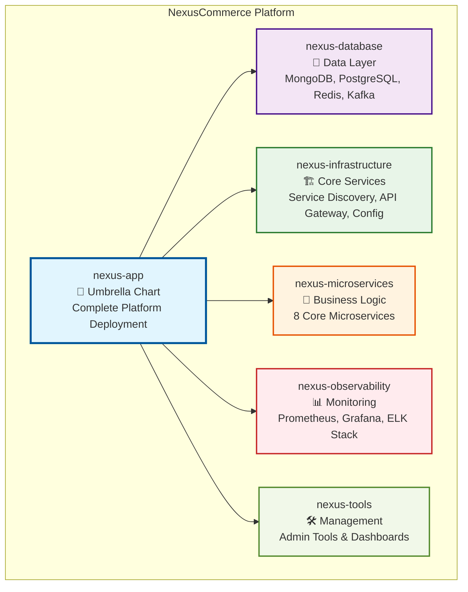
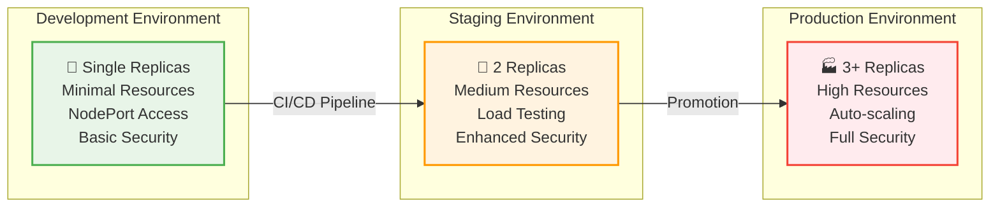
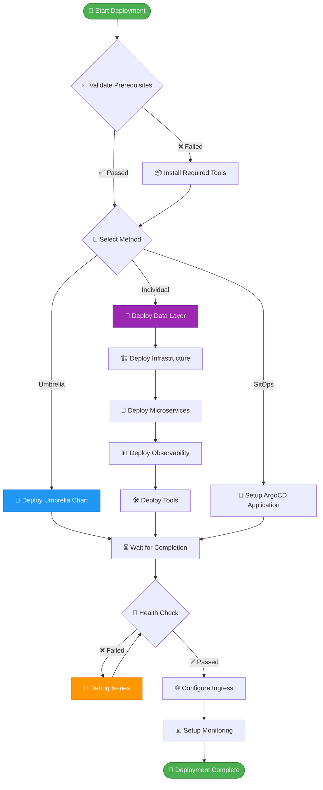
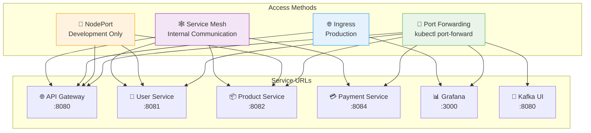
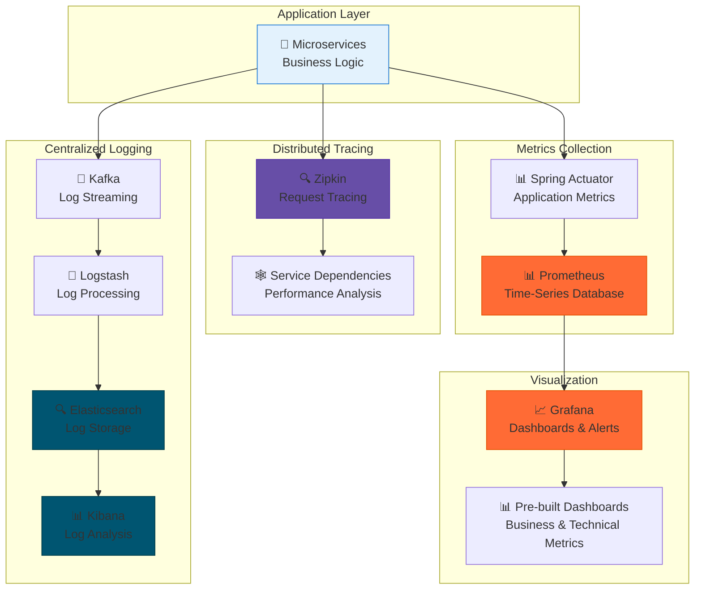
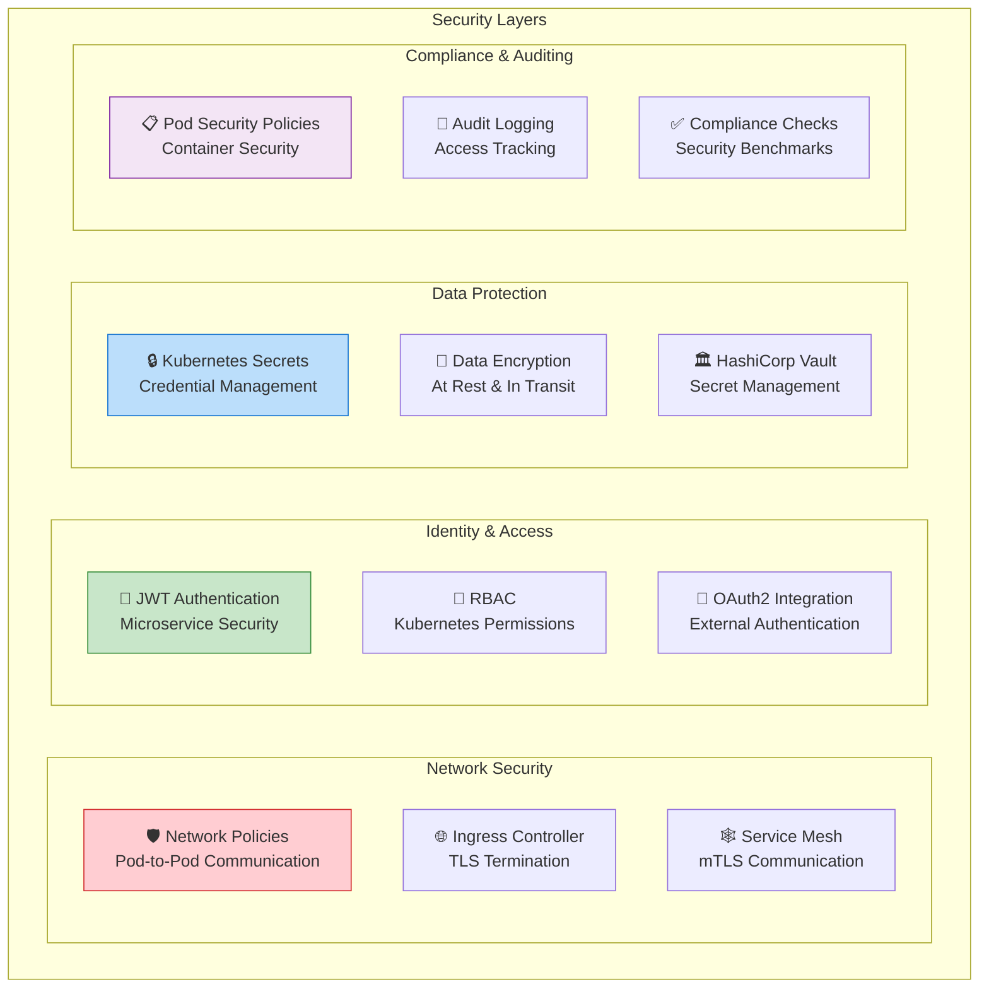
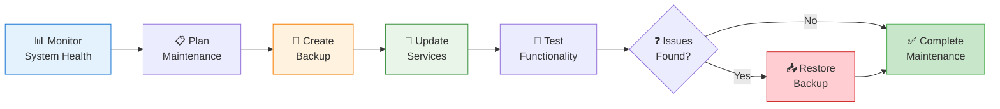
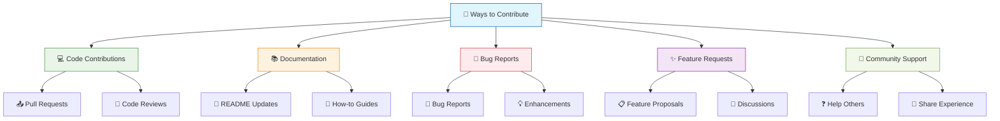

# NexusCommerce Helm Charts

<div align="center">


[](https://opensource.org/licenses/MIT)
[](https://helm.sh/)
[](https://kubernetes.io/)
[](Chart.yaml)

**🚀 Production-ready, cloud-native e-commerce microservices platform built for Kubernetes**

[Features](#-features) •
[Quick Start](#-quick-start) •
[Architecture](#️-architecture) •
[Installation](#-installation) •
[Documentation](#-documentation) •
[Contributing](#-contributing)

</div>

---

## 📋 Overview

NexusCommerce is a comprehensive, production-ready e-commerce platform designed for modern cloud environments. Built with microservices architecture, it provides a complete foundation for scalable online commerce solutions.

### 🎯 **What's Included**

This repository contains **6 interconnected Helm charts** that deploy a complete e-commerce ecosystem:



---

## 🌟 Features

### 🏪 **Complete E-commerce Stack**
- **👥 User Management** - Authentication, profiles, OAuth2/JWT
- **📦 Product Catalog** - CRUD operations, search, categories
- **🛒 Shopping Cart** - Session management, persistence
- **📋 Order Processing** - Workflow management, status tracking
- **💳 Payment Processing** - Stripe/PayPal integration, fraud detection
- **📢 Notifications** - Email, SMS, real-time updates
- **🎁 Loyalty Program** - Points system, tier management
- **🚚 Shipping** - GPS tracking, delivery management

### 🔧 **Production-Ready Infrastructure**
- **🔍 Service Discovery** - Eureka server with health monitoring
- **⚙️ Configuration Management** - Centralized config with hot reloading
- **🌐 API Gateway** - Request routing, rate limiting, authentication
- **📊 Distributed Tracing** - Zipkin for end-to-end observability
- **📈 Monitoring** - Prometheus metrics, Grafana dashboards
- **📝 Centralized Logging** - ELK stack integration

### 🚀 **Cloud-Native Features**
- **🎯 Multi-Environment Support** - Dev, Staging, Production configurations
- **📏 Auto-scaling** - HPA with CPU/memory metrics
- **🔒 Security First** - RBAC, network policies, secret management
- **💾 Data Persistence** - Persistent volumes with backup strategies
- **🌐 Ingress Management** - SSL termination, load balancing

---

## 🏗️ Architecture

### **High-Level System Architecture**

```mermaid
graph TB
    subgraph "External Traffic"
        Client[👤 Clients]
        Web[🌐 Web Apps]
        Mobile[📱 Mobile Apps]
    end

    subgraph "Edge Layer"
        LB[⚖️ Load Balancer]
        CDN[🌐 CDN]
    end

    subgraph "Kubernetes Cluster"
        subgraph "Ingress Layer"
            Ingress[🚪 Nginx Ingress<br/>SSL Termination]
        end
        
        subgraph "Infrastructure Namespace"
            Gateway[🚪 API Gateway<br/>:8080]
            Eureka[🔍 Service Discovery<br/>:8761]
            Config[⚙️ Config Server<br/>:8888]
            Zipkin[📊 Tracing<br/>:9411]
        end
        
        subgraph "Microservices Namespace"
            User[👥 User Service<br/>:8081]
            Product[📦 Product Service<br/>:8082]
            Cart[🛒 Cart Service<br/>:8082]
            Order[📋 Order Service<br/>:8082]
            Payment[💳 Payment Service<br/>:8084]
            Notification[📢 Notification Service<br/>:8086]
            Loyalty[🎁 Loyalty Service<br/>:8084]
            Shipping[🚚 Shipping Service<br/>:8085]
        end
        
        subgraph "Data Namespace"
            MongoDB[(🍃 MongoDB<br/>User, Cart, Notifications)]
            PostgreSQL[(🐘 PostgreSQL<br/>Products, Orders, Payments)]
            Redis[(⚡ Redis<br/>Cache & Sessions)]
            Kafka[📨 Kafka<br/>Event Streaming)]
        end
        
        subgraph "Observability Namespace"
            Prometheus[📊 Prometheus<br/>Metrics]
            Grafana[📈 Grafana<br/>Dashboards]
            Elasticsearch[🔍 Elasticsearch<br/>Logs]
            Kibana[📊 Kibana<br/>Log Analysis]
        end
        
        subgraph "Tools Namespace"
            KafkaUI[📨 Kafka UI]
            Adminer[🗃️ Adminer]
            PgAdmin[🐘 pgAdmin]
            RedisCmd[⚡ Redis Commander]
        end
    end

    %% External connections
    Client --> LB
    Web --> LB
    Mobile --> CDN
    LB --> Ingress
    CDN --> Ingress
    
    %% Request flow
    Ingress --> Gateway
    Gateway --> User
    Gateway --> Product
    Gateway --> Cart
    Gateway --> Order
    Gateway --> Payment
    
    %% Service discovery
    User -.-> Eureka
    Product -.-> Eureka
    Cart -.-> Eureka
    Order -.-> Eureka
    Payment -.-> Eureka
    Notification -.-> Eureka
    Loyalty -.-> Eureka
    Shipping -.-> Eureka
    
    %% Data connections
    User --> MongoDB
    Cart --> MongoDB
    Notification --> MongoDB
    Product --> PostgreSQL
    Order --> PostgreSQL
    Payment --> PostgreSQL
    Loyalty --> PostgreSQL
    Shipping --> PostgreSQL
    
    Cart --> Redis
    Order --> Redis
    Payment --> Redis
    
    User --> Kafka
    Product --> Kafka
    Cart --> Kafka
    Order --> Kafka
    Payment --> Kafka
    Notification --> Kafka
    Loyalty --> Kafka
    Shipping --> Kafka
    
    %% Monitoring
    User -.-> Prometheus
    Product -.-> Prometheus
    Cart -.-> Prometheus
    Order -.-> Prometheus
    Payment -.-> Prometheus
    Notification -.-> Prometheus
    Loyalty -.-> Prometheus
    Shipping -.-> Prometheus
    
    Prometheus --> Grafana
    Kafka --> Elasticsearch
    Elasticsearch --> Kibana

    classDef external fill:#e3f2fd,stroke:#1976d2,stroke-width:2px
    classDef infrastructure fill:#e8f5e8,stroke:#388e3c,stroke-width:2px
    classDef microservice fill:#fff3e0,stroke:#f57c00,stroke-width:2px
    classDef data fill:#f3e5f5,stroke:#7b1fa2,stroke-width:2px
    classDef observability fill:#ffebee,stroke:#d32f2f,stroke-width:2px
    classDef tools fill:#f1f8e9,stroke:#689f38,stroke-width:2px

    class Client,Web,Mobile,LB,CDN,Ingress external
    class Gateway,Eureka,Config,Zipkin infrastructure
    class User,Product,Cart,Order,Payment,Notification,Loyalty,Shipping microservice
    class MongoDB,PostgreSQL,Redis,Kafka data
    class Prometheus,Grafana,Elasticsearch,Kibana observability
    class KafkaUI,Adminer,PgAdmin,RedisCmd tools
```

### **Deployment Architecture by Environment**



---

## 🚀 Quick Start

### **Prerequisites**

| Component | Version | Purpose |
|-----------|---------|---------|
|  | 1.20+ | Container orchestration |
|  | 3.8+ | Package management |
|  | 8 Cores+ | Minimum cluster CPU |
|  | 16GB+ | Minimum cluster memory |
|  | 100GB+ | Persistent storage |

### **⚡ 5-Minute Demo Setup**

```bash
# 1. Clone the repository
git clone https://github.com/nexuscommerce/helm-charts.git
cd helm-charts

# 2. Deploy complete platform (development)
cd nexus-app
make dev

# 3. Wait for deployment
kubectl wait --for=condition=ready pod --all -n nexus-commerce --timeout=600s

# 4. Access the platform
make connect
make port-forward
```

### **🎯 Production Deployment**

```bash
# 1. Review and customize production values
vim nexus-app/values-prod.yaml

# 2. Deploy to production
make prod

# 3. Verify deployment
make status
make health
```

---

## 📦 Installation

### **Installation Methods**

<details>
<summary><strong>🎯 Method 1: Umbrella Chart (Recommended)</strong></summary>

Deploy the complete platform with a single command:

```bash
# Development
cd nexus-app
make dev

# Production
make prod

# Custom environment
helm install nexus-commerce . \
  -f values-prod.yaml \
  --namespace nexus-commerce \
  --create-namespace
```

</details>

<details>
<summary><strong>🔧 Method 2: Individual Charts</strong></summary>

Deploy charts individually for fine-grained control:

```bash
# 1. Data Layer
cd nexus-database
make prod

# 2. Infrastructure
cd ../nexus-infrastructure
make prod

# 3. Microservices
cd ../nexus-microservices
make prod

# 4. Observability
cd ../nexus-observability
make prod

# 5. Management Tools
cd ../nexus-tools
make prod
```

</details>

<details>
<summary><strong>📜 Method 3: GitOps with ArgoCD</strong></summary>

Deploy using GitOps practices:

```yaml
# argocd-application.yaml
apiVersion: argoproj.io/v1alpha1
kind: Application
metadata:
  name: nexus-commerce
  namespace: argocd
spec:
  project: default
  source:
    repoURL: https://github.com/nexuscommerce/helm-charts.git
    targetRevision: main
    path: nexus-app
    helm:
      valueFiles:
        - values-prod.yaml
  destination:
    server: https://kubernetes.default.svc
    namespace: nexus-commerce
  syncPolicy:
    automated:
      prune: true
      selfHeal: true
```

</details>

### **Deployment Flow**



---

## 📊 Repository Structure

```
nexus-commerce-helm-charts/
├── 📁 nexus-app/                    # 🎯 Umbrella Chart
│   ├── Chart.yaml                   # Main chart definition
│   ├── values.yaml                  # Default values
│   ├── values-dev.yaml             # Development overrides
│   ├── values-staging.yaml         # Staging overrides
│   ├── values-prod.yaml            # Production overrides
│   ├── Makefile                    # Automation commands
│   └── deploy.sh                   # Deployment script
│
├── 📁 nexus-database/              # 💾 Data Layer
│   ├── templates/
│   │   ├── mongodb/               # MongoDB StatefulSets
│   │   ├── postgresql/            # PostgreSQL clusters
│   │   ├── redis/                 # Redis instances
│   │   └── kafka/                 # Kafka brokers
│   ├── values-*.yaml              # Environment configs
│   └── README.md                  # Detailed documentation
│
├── 📁 nexus-infrastructure/        # 🏗️ Core Services
│   ├── templates/
│   │   ├── eureka/                # Service discovery
│   │   ├── config-server/         # Configuration management
│   │   ├── api-gateway/           # Request routing
│   │   └── zipkin/                # Distributed tracing
│   └── ...
│
├── 📁 nexus-microservices/         # 🔧 Business Logic
│   ├── templates/
│   │   ├── user-service/          # Authentication & users
│   │   ├── product-service/       # Product catalog
│   │   ├── cart-service/          # Shopping cart
│   │   ├── order-service/         # Order processing
│   │   ├── payment-service/       # Payment processing
│   │   ├── notification-service/  # Notifications
│   │   ├── loyalty-service/       # Loyalty program
│   │   └── shipping-service/      # Shipping management
│   └── ...
│
├── 📁 nexus-observability/         # 📊 Monitoring & Logging
│   ├── templates/
│   │   ├── prometheus/            # Metrics collection
│   │   ├── grafana/               # Dashboards
│   │   ├── elasticsearch/         # Log storage
│   │   ├── kibana/                # Log analysis
│   │   ├── logstash/              # Log processing
│   │   └── kiali/                 # Service mesh observability
│   └── ...
│
├── 📁 nexus-tools/                 # 🛠️ Management Tools
│   ├── templates/
│   │   ├── kafka-ui/              # Kafka management
│   │   ├── adminer/               # Database admin
│   │   ├── pgadmin/               # PostgreSQL admin
│   │   ├── redis-commander/       # Redis management
│   │   └── swagger-ui/            # API documentation
│   └── ...
│
├── 📄 README.md                    # This file
├── 📄 LICENSE                      # MIT License
└── 📁 docs/                        # Additional documentation
    ├── CONTRIBUTING.md             # Contribution guidelines
    ├── DEPLOYMENT.md               # Deployment guide
    ├── TROUBLESHOOTING.md          # Common issues
    └── ARCHITECTURE.md             # Detailed architecture
```

---

## ⚙️ Configuration

### **Environment-Specific Values**

Each chart supports multiple environments with optimized configurations:

| Environment | Use Case | Replicas | Resources | Security |
|-------------|----------|----------|-----------|----------|
| **development** | Local development & testing | Minimal (1) | Low | Basic |
| **staging** | Pre-production testing | Medium (2) | Medium | Enhanced |
| **production** | Live production workloads | High (3+) | High | Maximum |

### **Key Configuration Examples**

<details>
<summary><strong>🔧 Development Configuration</strong></summary>

```yaml
# nexus-app/values-dev.yaml
global:
  environment: development
  resources:
    requests:
      memory: "128Mi"
      cpu: "50m"
    limits:
      memory: "256Mi"
      cpu: "200m"

nexus-microservices:
  userService:
    replicas: 1
    service:
      type: NodePort
      nodePort: 30081
  
  paymentService:
    config:
      features:
        stripe: true
        paypal: false
        webhooks: false
      security:
        maxPaymentAmount: "1000.00"
```

</details>

<details>
<summary><strong>🏭 Production Configuration</strong></summary>

```yaml
# nexus-app/values-prod.yaml
global:
  environment: production
  resources:
    requests:
      memory: "512Mi"
      cpu: "250m"
    limits:
      memory: "1Gi"
      cpu: "500m"

nexus-microservices:
  userService:
    replicas: 3
    service:
      type: ClusterIP
    autoscaling:
      enabled: true
      minReplicas: 2
      maxReplicas: 10
      targetCPUUtilizationPercentage: 70
  
  paymentService:
    config:
      features:
        stripe: true
        paypal: true
        webhooks: true
      security:
        maxPaymentAmount: "50000.00"
```

</details>

---

## 🌐 Access & Connectivity

### **Service Endpoints**

After deployment, services are accessible via multiple methods:



### **Quick Access Commands**

```bash
# Get all connection information
make connect

# Set up port forwarding for all services
make port-forward

# Access individual services
kubectl port-forward -n nexus-commerce svc/api-gateway 8080:8080
kubectl port-forward -n nexus-commerce svc/grafana 3000:3000

# Check service health
make health

# View service endpoints
kubectl get ingress -n nexus-commerce
```

---

## 📊 Monitoring & Observability

### **Built-in Monitoring Stack**



### **Key Metrics & Dashboards**

- **📈 Business Metrics**: Orders, revenue, user activity, conversion rates
- **🔧 Technical Metrics**: Response times, error rates, throughput, resource usage
- **🏥 Health Metrics**: Service availability, dependency health, infrastructure status
- **🚨 Alerting**: Proactive notifications for critical issues

---

## 🔒 Security

### **Multi-Layered Security Architecture**



### **Security Features by Environment**

| Feature | Development | Staging | Production |
|---------|-------------|---------|------------|
| **Network Policies** | ❌ Disabled | ⚠️ Basic | ✅ Strict |
| **TLS/SSL** | ❌ HTTP Only | ✅ Let's Encrypt | ✅ Valid Certificates |
| **RBAC** | ✅ Basic | ✅ Enhanced | ✅ Strict |
| **Pod Security** | ❌ Relaxed | ✅ Standard | ✅ Restricted |
| **Secret Management** | ✅ Basic | ✅ Encrypted | ✅ Vault Integration |
| **Audit Logging** | ❌ Disabled | ✅ Basic | ✅ Comprehensive |

---

## 🔧 Operations

### **Common Operations**

<details>
<summary><strong>📊 Monitoring & Health Checks</strong></summary>

```bash
# Check overall platform health
make health

# View detailed status
make status

# Monitor logs in real-time
make logs-follow

# Check specific service
make debug SERVICE=user-service

# View metrics dashboard
make grafana-dashboard
```

</details>

<details>
<summary><strong>📈 Scaling Operations</strong></summary>

```bash
# Scale specific service
make scale SERVICE=user-service REPLICAS=5

# Enable auto-scaling
helm upgrade nexus-commerce . \
  --set nexus-microservices.autoscaling.enabled=true

# Check scaling status
kubectl get hpa -n nexus-commerce
```

</details>

<details>
<summary><strong>💾 Backup & Recovery</strong></summary>

```bash
# Create backup
make backup

# Restore from backup
make restore BACKUP_DATE=2024-01-15

# Check backup status
kubectl get cronjobs -n nexus-commerce
```

</details>

### **Maintenance Procedures**



---

## 🐛 Troubleshooting

### **Common Issues & Solutions**

<details>
<summary><strong>🔴 Services Not Starting</strong></summary>

**Symptoms**: Pods stuck in pending or crashing
```bash
# Check pod status
kubectl get pods -n nexus-commerce

# Check pod events
kubectl describe pod <pod-name> -n nexus-commerce

# Check logs
kubectl logs <pod-name> -n nexus-commerce

# Common solutions:
# 1. Resource constraints
kubectl top nodes
kubectl describe nodes

# 2. Image pull issues
kubectl get events -n nexus-commerce --field-selector type=Warning

# 3. Configuration errors
kubectl get configmaps -n nexus-commerce
```

</details>

<details>
<summary><strong>🔴 Database Connection Issues</strong></summary>

**Symptoms**: Services can't connect to databases
```bash
# Check database pods
kubectl get pods -n data

# Test connectivity
kubectl exec -n nexus-commerce deployment/user-service -- nc -zv mongodb-service.data.svc.cluster.local 27017

# Check secrets
kubectl get secrets -n nexus-commerce

# Verify DNS resolution
kubectl exec -n nexus-commerce deployment/user-service -- nslookup mongodb-service.data.svc.cluster.local
```

</details>

<details>
<summary><strong>🔴 Ingress/Networking Problems</strong></summary>

**Symptoms**: Services not accessible externally
```bash
# Check ingress status
kubectl get ingress -n nexus-commerce

# Check ingress controller
kubectl get pods -n ingress-nginx

# Test internal connectivity
kubectl run debug --image=busybox -it --rm -- sh
# From inside container:
wget -qO- http://api-gateway.nexus-commerce.svc.cluster.local:8080/health
```

</details>

### **Diagnostic Commands**

```bash
# Comprehensive platform diagnostics
make diagnose

# Check all resources
kubectl get all --all-namespaces | grep nexus

# View cluster events
kubectl get events --sort-by=.metadata.creationTimestamp

# Check resource usage
kubectl top nodes
kubectl top pods --all-namespaces
```

---

## 📚 Documentation

### **Chart-Specific Documentation**

| Chart | Purpose | Documentation |
|-------|---------|---------------|
| [nexus-app](./nexus-app/README.md) | 🎯 Umbrella chart for complete platform | Complete deployment guide |
| [nexus-database](./nexus-database/README.md) | 💾 Data layer (MongoDB, PostgreSQL, Redis, Kafka) | Database setup & configuration |
| [nexus-infrastructure](./nexus-infrastructure/README.md) | 🏗️ Core services (Eureka, Gateway, Config) | Infrastructure services guide |
| [nexus-microservices](./nexus-microservices/README.md) | 🔧 Business logic (8 microservices) | Microservices deployment |
| [nexus-observability](./nexus-observability/README.md) | 📊 Monitoring (Prometheus, Grafana, ELK) | Observability setup |
| [nexus-tools](./nexus-tools/README.md) | 🛠️ Management tools (Admin interfaces) | Tools configuration |

### **Additional Resources**

- **🏗️ [Architecture Guide](./docs/ARCHITECTURE.md)** - Detailed system architecture
- **🚀 [Deployment Guide](./docs/DEPLOYMENT.md)** - Step-by-step deployment instructions
- **🔧 [Configuration Guide](./docs/CONFIGURATION.md)** - Advanced configuration options
- **🐛 [Troubleshooting Guide](./docs/TROUBLESHOOTING.md)** - Common issues and solutions
- **🔒 [Security Guide](./docs/SECURITY.md)** - Security best practices
- **📊 [Monitoring Guide](./docs/MONITORING.md)** - Observability setup
- **🤝 [Contributing Guide](./CONTRIBUTING.md)** - How to contribute

---

## 🤝 Contributing

We welcome contributions from the community! Here's how you can help:

### **Ways to Contribute**



### **Getting Started**

1. **🍴 Fork the repository**
2. **🌿 Create a feature branch** (`git checkout -b feature/amazing-feature`)
3. **💻 Make your changes**
4. **🧪 Test thoroughly** (`make test` and `make lint`)
5. **📝 Update documentation**
6. **📤 Submit a pull request**

### **Development Setup**

```bash
# Clone your fork
git clone https://github.com/yourusername/nexus-commerce-helm-charts.git
cd nexus-commerce-helm-charts

# Install development dependencies
make setup-dev

# Run tests
make test-all

# Lint charts
make lint-all

# Test deployment
make test-deploy
```

### **Contribution Guidelines**

- ✅ Follow Kubernetes and Helm best practices
- ✅ Include comprehensive tests for new features
- ✅ Update documentation for any changes
- ✅ Use semantic commit messages
- ✅ Ensure backward compatibility

---

## 📄 License

This project is licensed under the **MIT License** - see the [LICENSE](LICENSE) file for details.

```
MIT License

Copyright (c) 2024 NexusCommerce

Permission is hereby granted, free of charge, to any person obtaining a copy
of this software and associated documentation files (the "Software"), to deal
in the Software without restriction, including without limitation the rights
to use, copy, modify, merge, publish, distribute, sublicense, and/or sell
copies of the Software, and to permit persons to whom the Software is
furnished to do so, subject to the following conditions:

The above copyright notice and this permission notice shall be included in all
copies or substantial portions of the Software.
```

---

## 🆘 Support & Community

<div align="center">

### **Get Help & Stay Connected**

[](https://docs.nexuscommerce.com)
[](https://github.com/nexuscommerce/helm-charts/issues)
[](https://github.com/nexuscommerce/helm-charts/discussions)
[](https://discord.gg/nexuscommerce)

[](https://stackoverflow.com/questions/tagged/nexuscommerce)
[](https://twitter.com/nexuscommerce)
[](https://linkedin.com/company/nexuscommerce)

</div>

### **Support Channels**

| Channel | Best For | Response Time |
|---------|----------|---------------|
| 📖 **Documentation** | How-to guides, tutorials | Self-service |
| 🐛 **GitHub Issues** | Bug reports, feature requests | 1-2 business days |
| 💬 **GitHub Discussions** | Questions, ideas, feedback | Community-driven |
| 💬 **Discord** | Real-time chat, quick questions | Community-driven |
| 📧 **Email** | Security issues, partnerships | 2-3 business days |

---

## 🌟 Acknowledgments

Special thanks to our amazing contributors and the open-source community:

- **Kubernetes Community** for the robust orchestration platform
- **Helm Community** for the excellent package manager
- **Spring Boot Team** for the microservices framework
- **All Contributors** who have helped improve this project

---

<div align="center">

## ⭐ **Star this repository if it helped you!**

[](https://github.com/nexuscommerce/helm-charts/stargazers)
[](https://github.com/nexuscommerce/helm-charts/network/members)
[](https://github.com/nexuscommerce/helm-charts/watchers)

**🚀 Built with ❤️ by the [NexusCommerce Team](https://github.com/nexuscommerce)**

*Making e-commerce scalable, one microservice at a time*

</div>