# 🚀 NexusCommerce Database Helm Chart

[](https://helm.sh/)
[](https://kubernetes.io/)
[](LICENSE)
[](Chart.yaml)

> A comprehensive, production-ready Helm chart for deploying the complete NexusCommerce database infrastructure including MongoDB, PostgreSQL, Redis, and Kafka messaging systems.

## 📋 Table of Contents

- [🏗️ Architecture Overview](#️-architecture-overview)
- [🎯 Features](#-features)
- [📋 Prerequisites](#-prerequisites)
- [🚀 Quick Start](#-quick-start)
- [⚙️ Configuration](#️-configuration)
- [🔧 Installation Methods](#-installation-methods)
- [🔗 Database Connections](#-database-connections)
- [📊 Monitoring & Observability](#-monitoring--observability)
- [🔒 Security](#-security)
- [💾 Backup & Recovery](#-backup--recovery)
- [🔍 Troubleshooting](#-troubleshooting)
- [🚀 Scaling](#-scaling)
- [🗑️ Uninstallation](#️-uninstallation)
- [🤝 Contributing](#-contributing)

## 🏗️ Architecture Overview

### Database Stack Architecture

```mermaid
graph TB
    subgraph "NexusCommerce Microservices"
        CS[Cart Service]
        US[User Service]
        PS[Product Service]
        PMS[Payment Service]
        OS[Order Service]
        LS[Loyalty Service]
        SS[Shipping Service]
    end
    
    subgraph "Database Layer"
        subgraph "MongoDB Cluster"
            CM[(Cart MongoDB)]
            UM[(User MongoDB)]
        end
        
        subgraph "PostgreSQL Cluster"
            PP[(Product DB)]
            PM[(Payment DB)]
            OP[(Order DB)]
            LP[(Loyalty DB)]
            SP[(Shipping DB)]
        end
        
        subgraph "Cache & Messaging"
            R[(Redis Cache)]
            K[Kafka Cluster]
            Z[Zookeeper]
        end
    end
    
    subgraph "Infrastructure"
        PV[Persistent Volumes]
        NS[Kubernetes Namespace]
        SC[Storage Classes]
    end
    
    CS --> CM
    US --> UM
    PS --> PP
    PMS --> PM
    OS --> OP
    LS --> LP
    SS --> SP
    
    CS --> R
    US --> R
    PS --> R
    
    CS --> K
    US --> K
    PS --> K
    PMS --> K
    OS --> K
    
    K --> Z
    
    CM --> PV
    UM --> PV
    PP --> PV
    PM --> PV
    OP --> PV
    R --> PV
    K --> PV
    
    style CM fill:#47A248
    style UM fill:#47A248
    style PP fill:#336791
    style PM fill:#336791
    style OP fill:#336791
    style LP fill:#336791
    style SP fill:#336791
    style R fill:#DC382D
    style K fill:#231F20
    style Z fill:#231F20
```

### Environment Deployment Strategy

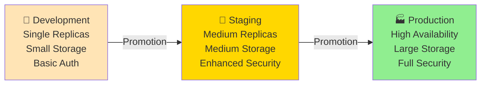

### Network Flow Diagram

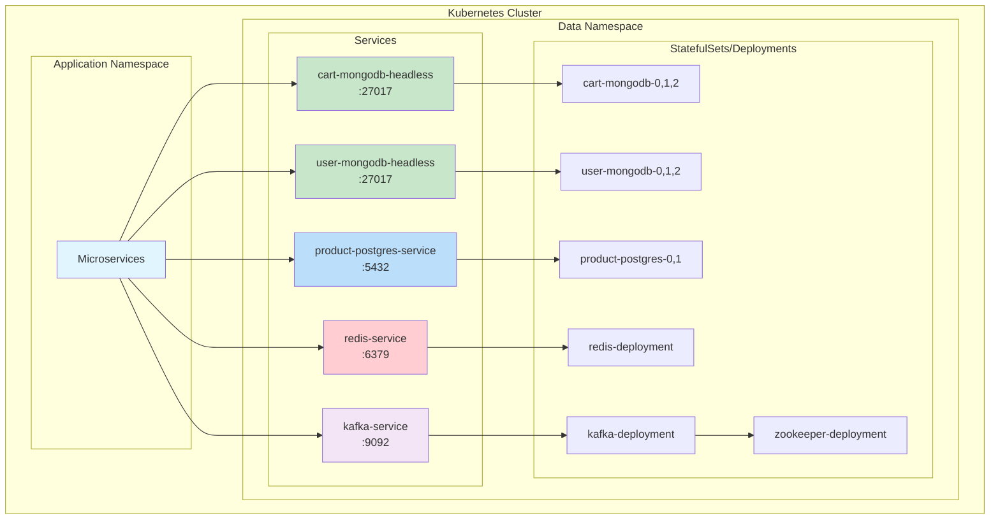

## 🎯 Features

### 🗄️ **Multi-Database Support**
- **MongoDB**: Document storage for cart and user data
- **PostgreSQL**: Relational data for products, payments, orders, loyalty, and shipping
- **Redis**: High-performance caching and session management
- **Kafka**: Event streaming and messaging backbone

### 🌍 **Multi-Environment Ready**
- **Development**: Resource-optimized for local development
- **Staging**: Production-like environment for testing
- **Production**: High-availability, enterprise-grade deployment

### 🔄 **High Availability**
- StatefulSet deployments with configurable replicas
- Pod anti-affinity for optimal distribution
- Persistent volume management
- Health checks and auto-recovery

### 🛡️ **Security First**
- RBAC integration
- Network policies (production)
- Secret management
- Encrypted connections

### 📈 **Monitoring & Observability**
- Prometheus metrics integration
- Health check endpoints
- Performance monitoring
- Resource utilization tracking

## 📋 Prerequisites

| Component | Version | Purpose |
|-----------|---------|---------|
| **Kubernetes** | 1.20+ | Container orchestration |
| **Helm** | 3.8+ | Package management |
| **StorageClass** | Available | Persistent storage |
| **Resources** | 8GB RAM, 4 CPU | Minimum cluster capacity |

### Resource Requirements by Environment

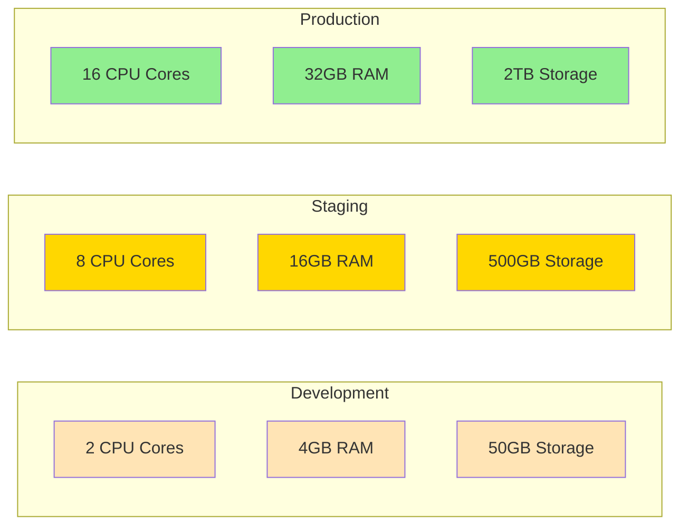

## 🚀 Quick Start

### 1. **Clone or Download**
```bash
# If using Git
git clone https://github.com/nexuscommerce/helm-charts.git
cd helm-charts/nexus-database

# Or download and extract
```

### 2. **Quick Development Deployment**
```bash
# Using make (recommended)
make dev

# Using helm directly
helm install nexus-database . -f values-dev.yaml \
  --namespace data --create-namespace
```

### 3. **Quick Production Deployment**
```bash
# Using make with enhanced deployment script
make prod

# Using deployment script directly
./deploy.sh -e prod -u
```

### 4. **Verify Installation**
```bash
# Check deployment status
make status

# View connection information
make connect

# Monitor logs
make logs
```

## ⚙️ Configuration

### Environment-Specific Deployments

| Environment | Replicas | Resources | Storage | Purpose |
|-------------|----------|-----------|---------|---------|
| **🔧 Development** | Minimal (1) | Low | Small | Local development & testing |
| **🚦 Staging** | Medium (2-3) | Medium | Medium | Pre-production validation |
| **🏭 Production** | High (3+) | High | Large | Live production workloads |

### Key Configuration Files

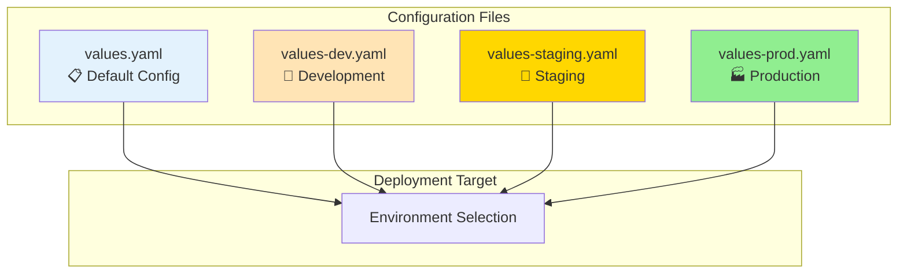

### Core Parameters

#### Global Configuration
```yaml
global:
  namespace: data                    # Kubernetes namespace
  environment: production            # Environment identifier
  storageClass: standard            # Storage class for PVs
  nodeSelector:                     # Node placement
    node-role: data
```

#### MongoDB Configuration
```yaml
mongodb:
  enabled: true
  cart:
    enabled: true
    replicas: 2                     # Number of replicas
    database:
      name: cartdb                  # Database name
    auth:
      username: cartservice         # Service username
    storage:
      data:
        size: 10Gi                  # Data storage size
```

#### PostgreSQL Configuration
```yaml
postgresql:
  enabled: true
  product:
    enabled: true
    database:
      name: productdb
    auth:
      username: productservice
    storage:
      size: 10Gi
```

## 🔧 Installation Methods

### Method 1: Make Commands (Recommended)

```bash
# Development environment
make dev

# Staging environment
make staging

# Production environment
make prod

# Upgrade existing deployment
make upgrade ENVIRONMENT=prod

# Dry run to preview changes
make dry-run ENVIRONMENT=staging
```

### Method 2: Deployment Script

```bash
# Basic installation
./deploy.sh -e dev

# Production with upgrade
./deploy.sh -e prod -u

# Dry run for staging
./deploy.sh -e staging -d

# Force upgrade with debug
./deploy.sh -e prod -u --force --debug
```

### Method 3: Direct Helm Commands

```bash
# Install development
helm install nexus-database . \
  -f values-dev.yaml \
  --namespace data \
  --create-namespace

# Upgrade production
helm upgrade nexus-database . \
  -f values-prod.yaml \
  --namespace data \
  --timeout 15m

# Uninstall
helm uninstall nexus-database --namespace data
```

### Deployment Flow

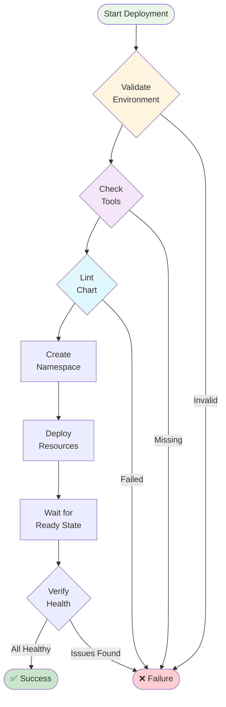

## 🔗 Database Connections

After successful deployment, services can connect using these URLs:

### 📊 Connection Overview

```mermaid
graph TB
    subgraph "Service Connections"
        CS[Cart Service]
        US[User Service]
        PS[Product Service]
        PMS[Payment Service]
        OS[Order Service]
        LS[Loyalty Service]
        SS[Shipping Service]
        ALL[All Services]
    end
    
    subgraph "Database URLs"
        CMURL["mongodb://cart-mongodb-headless.data.svc.cluster.local:27017/cartdb"]
        UMURL["mongodb://user-mongodb-headless.data.svc.cluster.local:27017/userdb"]
        PPURL["product-postgres-service.data.svc.cluster.local:5432/productdb"]
        PMURL["payment-postgres-service.data.svc.cluster.local:5432/paymentdb"]
        OPURL["order-postgres-service.data.svc.cluster.local:5432/orderdb"]
        LPURL["loyalty-postgres-service.data.svc.cluster.local:5432/loyalty-service"]
        SPURL["shipping-postgres-service.data.svc.cluster.local:5432/shippingdb"]
        RURL["redis-service.data.svc.cluster.local:6379"]
        KURL["kafka-service.data.svc.cluster.local:9092"]
    end
    
    CS --> CMURL
    US --> UMURL
    PS --> PPURL
    PMS --> PMURL
    OS --> OPURL
    LS --> LPURL
    SS --> SPURL
    ALL --> RURL
    ALL --> KURL
    
    style CMURL fill:#C8E6C9
    style UMURL fill:#C8E6C9
    style PPURL fill:#BBDEFB
    style PMURL fill:#BBDEFB
    style OPURL fill:#BBDEFB
    style LPURL fill:#BBDEFB
    style SPURL fill:#BBDEFB
    style RURL fill:#FFCDD2
    style KURL fill:#F3E5F5
```

### 🍃 MongoDB Connections
```bash
# Cart Service Database
mongodb://cart-mongodb-headless.data.svc.cluster.local:27017/cartdb

# User Service Database
mongodb://user-mongodb-headless.data.svc.cluster.local:27017/userdb
```

### 🐘 PostgreSQL Connections
```bash
# Product Service
product-postgres-service.data.svc.cluster.local:5432/productdb

# Payment Service
payment-postgres-service.data.svc.cluster.local:5432/paymentdb

# Order Service
order-postgres-service.data.svc.cluster.local:5432/orderdb

# Loyalty Service
loyalty-postgres-service.data.svc.cluster.local:5432/loyalty-service

# Shipping Service
shipping-postgres-service.data.svc.cluster.local:5432/shippingdb
```

### ⚡ Redis & Messaging
```bash
# Redis Cache
redis-service.data.svc.cluster.local:6379

# Kafka Messaging
kafka-service.data.svc.cluster.local:9092
```

### 🔐 Accessing Credentials
```bash
# List all secrets
kubectl get secrets -n data

# Get MongoDB password
kubectl get secret cart-mongodb-secret -n data -o jsonpath='{.data.password}' | base64 -d

# Get PostgreSQL password
kubectl get secret product-postgres-secret -n data -o jsonpath='{.data.password}' | base64 -d
```

## 📊 Monitoring & Observability

### Health Check Dashboard

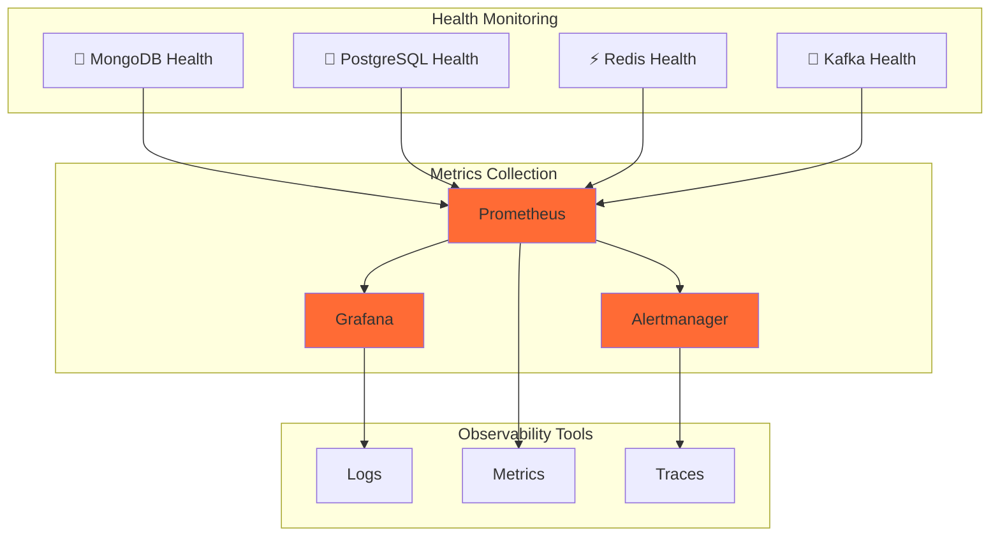

### Enabling Monitoring
```yaml
monitoring:
  enabled: true
  prometheus:
    enabled: true
    serviceMonitor:
      enabled: true
  grafana:
    enabled: true
    dashboards:
      enabled: true
```

### Health Check Commands
```bash
# Check all service health
make health

# Monitor real-time status
make watch

# View comprehensive logs
make logs

# Follow logs in real-time
make logs-follow
```

## 🔒 Security

### Security Architecture

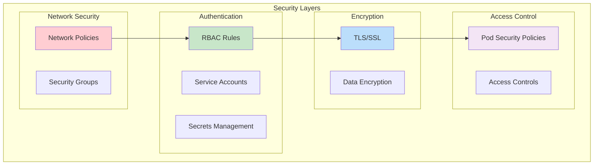

### Environment Security Profiles

| Feature | Development | Staging | Production |
|---------|------------|---------|------------|
| **Network Policies** | ❌ Disabled | ✅ Basic | ✅ Strict |
| **RBAC** | 🔒 Basic | 🔒 Enhanced | 🔒 Full |
| **TLS/SSL** | ❌ Optional | ✅ Enabled | ✅ Required |
| **Secret Rotation** | ❌ Manual | 🔄 Scheduled | 🔄 Automated |
| **Audit Logging** | ❌ Disabled | 📝 Basic | 📝 Comprehensive |

### Updating Security Credentials

```bash
# Update MongoDB password
kubectl create secret generic cart-mongodb-secret \
  --from-literal=username=cartservice \
  --from-literal=password=your-secure-password \
  --namespace data \
  --dry-run=client -o yaml | kubectl apply -f -

# Update PostgreSQL password
kubectl create secret generic product-postgres-secret \
  --from-literal=username=productservice \
  --from-literal=password=your-secure-password \
  --namespace data \
  --dry-run=client -o yaml | kubectl apply -f -
```

## 💾 Backup & Recovery

### Backup Strategy

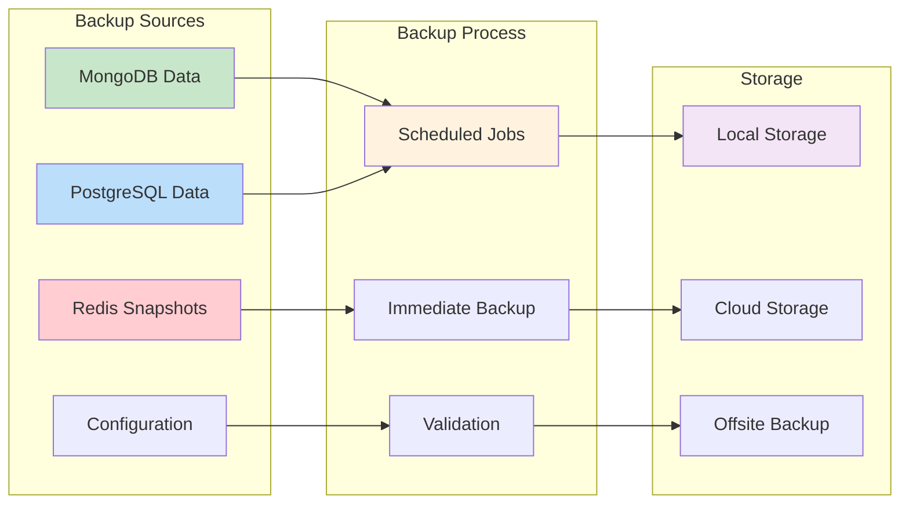

### Enabling Automated Backups

```yaml
backup:
  enabled: true
  schedule: "0 2 * * *"        # Daily at 2 AM
  retention: 30                # Keep for 30 days
  storage:
    type: "persistent-volume"
    size: "100Gi"
  destinations:
    - local
    - s3
```

### Manual Backup Operations

```bash
# Trigger immediate backup
make backup-now

# MongoDB manual backup
kubectl exec -n data cart-mongodb-0 -- \
  mongodump --out /tmp/backup --authenticationDatabase admin

# PostgreSQL manual backup
kubectl exec -n data product-postgres-0 -- \
  pg_dump productdb > /tmp/product-backup.sql

# Redis snapshot
kubectl exec -n data redis-service-0 -- redis-cli BGSAVE
```

### Recovery Procedures

```bash
# Restore from backup (example)
./restore.sh --backup-date 2024-01-15 --component mongodb

# Point-in-time recovery
./restore.sh --timestamp "2024-01-15 14:30:00" --database productdb
```

## 🔍 Troubleshooting

### Common Issues Resolution

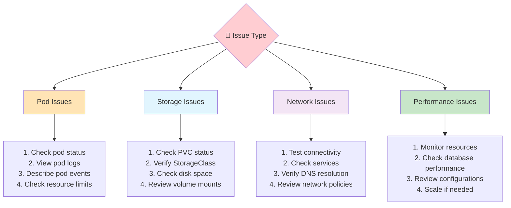

### Diagnostic Commands

```bash
# Comprehensive status check
make status

# Debug deployment issues
make debug

# Describe failed pods
make describe

# Check cluster resources
kubectl top nodes
kubectl top pods -n data

# View recent events
kubectl get events -n data --sort-by='.lastTimestamp' --field-selector type=Warning
```

### Issue-Specific Solutions

#### 🚨 **Pods Stuck in Pending**
```bash
# Check resource constraints
kubectl describe nodes
kubectl describe pod <pod-name> -n data

# Common solutions:
# - Insufficient cluster resources
# - StorageClass issues
# - Node selector constraints
```

#### 🚨 **MongoDB Connection Failures**
```bash
# Check MongoDB status
kubectl logs -n data cart-mongodb-0

# Verify authentication
kubectl exec -n data cart-mongodb-0 -- mongosh --eval "db.adminCommand('ping')"

# Check service connectivity
kubectl exec -n data debug-pod -- nc -zv cart-mongodb-headless 27017
```

#### 🚨 **PostgreSQL Startup Issues**
```bash
# Check PostgreSQL logs
kubectl logs -n data product-postgres-0

# Verify database readiness
kubectl exec -n data product-postgres-0 -- pg_isready

# Check permissions
kubectl exec -n data product-postgres-0 -- ls -la /var/lib/postgresql/data
```

## 🚀 Scaling

### Scaling Strategy

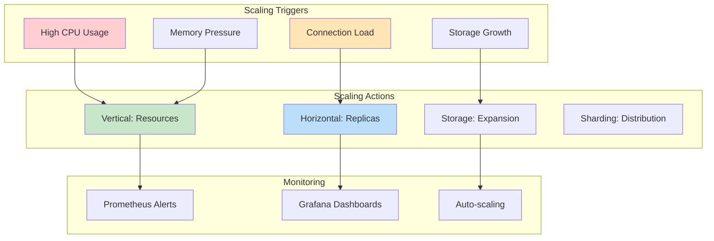

### Horizontal Scaling

```bash
# Scale MongoDB replicas
helm upgrade nexus-database . \
  --set mongodb.cart.replicas=3 \
  --namespace data

# Scale PostgreSQL (requires read replicas)
kubectl scale statefulset product-postgres --replicas=2 -n data

# Scale Redis for clustering
helm upgrade nexus-database . \
  --set redis.replicas=3 \
  --namespace data
```

### Vertical Scaling

```bash
# Increase resources
helm upgrade nexus-database . \
  --set mongodb.cart.resources.limits.memory=2Gi \
  --set mongodb.cart.resources.limits.cpu=1000m \
  --namespace data
```

### Storage Expansion

```bash
# Expand PVC (if StorageClass supports it)
kubectl patch pvc mongodb-data-cart-mongodb-0 \
  -n data \
  -p '{"spec":{"resources":{"requests":{"storage":"50Gi"}}}}'
```

## 🗑️ Uninstallation

### Uninstall Options

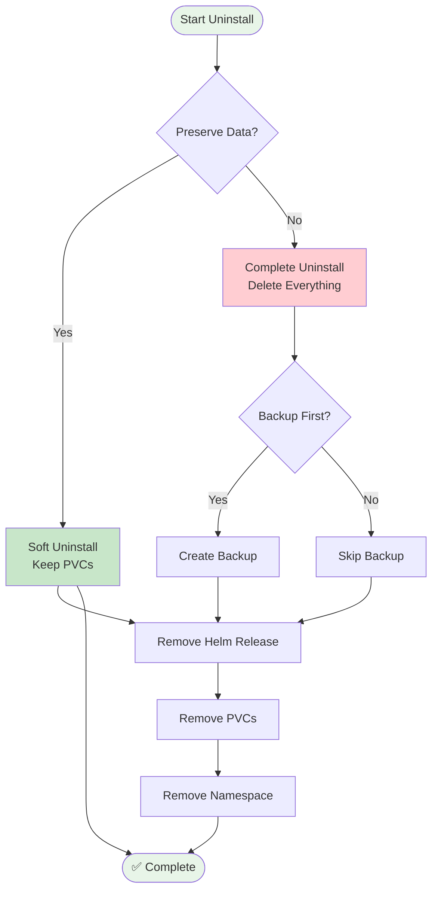

### Safe Uninstallation (Preserve Data)

```bash
# Using make
make clean

# Using undeploy script (keeps PVCs)
./undeploy.sh -k

# Using helm (manual PVC management)
helm uninstall nexus-database -n data
# PVCs remain for later use
```

### Complete Removal (⚠️ Data Loss)

```bash
# Using undeploy script with force
./undeploy.sh -f

# Manual complete removal
helm uninstall nexus-database -n data
kubectl delete pvc --all -n data
kubectl delete namespace data
```

### Backup Before Uninstall

```bash
# Create backup before removal
./undeploy.sh --backup-first -k

# Verify backup completion before proceeding
kubectl get jobs -n data
```

## 🤝 Contributing

### Development Workflow

```mermaid
graph LR
    FORK[🍴 Fork Repository]
    CLONE[📥 Clone Fork]
    BRANCH[🌿 Create Branch]
    CODE[💻 Make Changes]
    TEST[🧪 Test Changes]
    PR[📤 Pull Request]
    REVIEW[👀 Code Review]
    MERGE[🔀 Merge]
    
    FORK --> CLONE
    CLONE --> BRANCH
    BRANCH --> CODE
    CODE --> TEST
    TEST --> PR
    PR --> REVIEW
    REVIEW --> MERGE
    
    style FORK fill:#E8F5E8
    style TEST fill:#FFF3E0
    style REVIEW fill:#F3E5F5
    style MERGE fill:#C8E6C9
```

### Contributing Steps

1. **🍴 Fork the repository**
2. **🌿 Create a feature branch**
   ```bash
   git checkout -b feature/amazing-feature
   ```
3. **💻 Make your changes**
4. **🧪 Test thoroughly**
   ```bash
   make lint
   make test
   make template-all
   ```
5. **📝 Update documentation**
6. **📤 Submit a pull request**

### Chart Development

```bash
# Lint the chart
make lint

# Test template rendering
make test

# Debug template issues
helm template nexus-database . -f values-dev.yaml --debug

# Package for distribution
make package
```

### Adding New Databases

1. **📝 Add configuration to `values.yaml`**
2. **🗂️ Create templates in `templates/` directory**
3. **🏷️ Update `_helpers.tpl` with new labels**
4. **🧪 Test with `helm template`**
5. **📚 Update documentation**

---

## 🆘 Support & Resources

### 📞 **Getting Help**
- **📚 Documentation**: [docs.nexuscommerce.com](https://docs.nexuscommerce.com)
- **🐛 Issues**: [GitHub Issues](https://github.com/nexuscommerce/helm-charts/issues)
- **💬 Community**: [Discord Server](https://discord.gg/nexuscommerce)
- **📧 Email**: [team@nexuscommerce.com](mailto:team@nexuscommerce.com)

### 🏷️ **Version Information**
- **Chart Version**: 0.1.0
- **App Version**: 1.0.0
- **Kubernetes**: 1.20+
- **Helm**: 3.8+

### 📄 **License**
This chart is licensed under the **MIT License**. See [LICENSE](LICENSE) file for details.

---

<div align="center">

**🚀 Built with ❤️ by the NexusCommerce Team**

[](https://github.com/nexuscommerce/helm-charts)
[](https://discord.gg/nexuscommerce)
[](https://twitter.com/nexuscommerce)

</div>