# NexusCommerce Infrastructure Helm Chart

<div align="center">


**🚀 A comprehensive Helm chart for deploying the complete NexusCommerce infrastructure stack**

[](https://opensource.org/licenses/MIT)
[](https://helm.sh/)
[](https://kubernetes.io/)

</div>

## 🏗️ System Architecture


## 📋 Overview

This chart deploys a full infrastructure platform for the NexusCommerce microservices ecosystem, providing:

### 🔍 **Service Discovery**
- **Eureka Server** for dynamic service registration and discovery
- Automatic health monitoring and load balancing

### ⚙️ **Configuration Management**
- **Config Server** for centralized configuration
- Git-based configuration with hot reloading

### 🌐 **API Gateway**
- Request routing, rate limiting, and CORS handling
- JWT authentication and request transformation

### 📊 **Distributed Tracing**
- **Zipkin** for request tracking and performance monitoring
- End-to-end observability across services

### 🚪 **Ingress Controller**
- **Nginx** for external traffic management
- SSL termination and load balancing

### 💊 **Health Monitoring**
- Actuator endpoints for all services
- Comprehensive health checks and metrics

## 🚀 Quick Start

### Prerequisites


### 🏃‍♂️ Quick Deployment

```bash
# 1. Deploy data layer first
cd ../nexus-database
make dev

# 2. Deploy infrastructure
make dev

# 3. Verify deployment
make status
```

## 🎯 Deployment Flow

```mermaid
flowchart TD
    START([Start Deployment]) --> CHECK{Prerequisites Check}
    CHECK -->|✅ Pass| NS[Create Namespace]
    CHECK -->|❌ Fail| ERROR[❌ Exit with Error]
    
    NS --> DATA{Data Layer Ready?}
    DATA -->|❌ No| DEPLOY_DATA[Deploy Data Layer]
    DATA -->|✅ Yes| EUR_DEPLOY[Deploy Eureka Server]
    DEPLOY_DATA --> EUR_DEPLOY
    
    EUR_DEPLOY --> EUR_WAIT[Wait for Eureka Ready]
    EUR_WAIT --> CS_DEPLOY[Deploy Config Server]
    CS_DEPLOY --> CS_WAIT[Wait for Config Server Ready]
    
    CS_WAIT --> PARALLEL{Deploy in Parallel}
    PARALLEL --> ZIP_DEPLOY[Deploy Zipkin]
    PARALLEL --> ING_DEPLOY[Deploy Ingress Controller]
    PARALLEL --> GW_DEPLOY[Deploy API Gateway]
    
    ZIP_DEPLOY --> HEALTH[Health Checks]
    ING_DEPLOY --> HEALTH
    GW_DEPLOY --> GW_WAIT[Wait for Dependencies]
    GW_WAIT --> HEALTH
    
    HEALTH --> VERIFY{All Services Healthy?}
    VERIFY -->|✅ Yes| SUCCESS[🎉 Deployment Complete]
    VERIFY -->|❌ No| TROUBLESHOOT[🔧 Troubleshoot]
    TROUBLESHOOT --> HEALTH
    
    style START fill:#e8f5e8
    style SUCCESS fill:#c8e6c9
    style ERROR fill:#ffcdd2
    style TROUBLESHOOT fill:#fff3e0
```



## 🌍 Environment Configurations

| Environment | 🔧 Replicas | 💾 Resources | 🎯 Purpose |
|-------------|-------------|--------------|------------|
| **🧪 Development** | Minimal (1) | Low | Development & testing |
| **🚦 Staging** | Medium (2) | Medium | Pre-production testing |
| **🏭 Production** | High (3) | High | Production workloads |

### 📝 Values Files Structure


## 📦 Installation

### 🎯 Using Make (Recommended)

```bash
# 🧪 Development
make dev

# 🚦 Staging  
make staging

# 🏭 Production
make prod

# 🔄 Upgrade existing deployment
make upgrade ENVIRONMENT=prod

# 🧪 Dry run
make dry-run ENVIRONMENT=staging
```

### 🔧 Using Deployment Script

```bash
# Install development
./deploy.sh -e dev

# Install production with upgrade
./deploy.sh -e prod -u

# Dry run for staging
./deploy.sh -e staging -d
```

### ⚙️ Using Helm Directly

```bash
# Install
helm install nexus-infrastructure . \
  -f values-dev.yaml \
  --namespace infrastructure \
  --create-namespace

# Upgrade
helm upgrade nexus-infrastructure . \
  -f values-prod.yaml \
  --namespace infrastructure
```

## 🔧 Configuration Parameters

### 🌐 Global Parameters

| Parameter | Description | Default |
|-----------|-------------|---------|
| `global.namespace` | Kubernetes namespace | `infrastructure` |
| `global.environment` | Environment name | `production` |
| `global.storageClass` | Storage class for PVs | `standard` |
| `global.nodeSelector` | Node selector for pods | `{node-role: infrastructure}` |

### 🔍 Service Discovery (Eureka)


| Parameter | Description | Default |
|-----------|-------------|---------|
| `eureka.enabled` | Enable Eureka deployment | `true` |
| `eureka.replicas` | Number of Eureka replicas | `2` |
| `eureka.image.repository` | Eureka image repository | `yahyazakaria123/ecommerce-app-discovery-service` |
| `eureka.service.port` | Eureka service port | `8761` |

### ⚙️ Configuration Management (Config Server)

| Parameter | Description | Default |
|-----------|-------------|---------|
| `configServer.enabled` | Enable Config Server | `true` |
| `configServer.replicas` | Number of replicas | `1` |
| `configServer.config.gitUri` | Git repository URI | `https://github.com/Saoudyahya/...` |
| `configServer.service.port` | Config Server port | `8888` |

### 🌐 API Gateway

| Parameter | Description | Default |
|-----------|-------------|---------|
| `apiGateway.enabled` | Enable API Gateway | `true` |
| `apiGateway.replicas` | Number of replicas | `2` |
| `apiGateway.service.port` | API Gateway port | `8099` |
| `apiGateway.config.cors.allowedOrigins` | CORS allowed origins | `http://localhost:3000,http://localhost:8080` |

### 📊 Distributed Tracing (Zipkin)

| Parameter | Description | Default |
|-----------|-------------|---------|
| `zipkin.enabled` | Enable Zipkin | `true` |
| `zipkin.service.port` | Zipkin port | `9411` |
| `zipkin.storage.type` | Storage backend | `mem` |

## 🔗 Service Communication


### 🔗 Internal Service URLs

```yaml
# Service Discovery
eureka: http://eureka-server.infrastructure.svc.cluster.local:8761

# Configuration Management  
config: http://config-server.infrastructure.svc.cluster.local:8888

# API Gateway
gateway: http://api-gateway.infrastructure.svc.cluster.local:8099

# Distributed Tracing
zipkin: http://zipkin-server.infrastructure.svc.cluster.local:9411
```

### 💊 Health Check URLs

```yaml
# Health Endpoints
eureka-health: http://eureka-server.infrastructure.svc.cluster.local:8761/actuator/health
config-health: http://config-server.infrastructure.svc.cluster.local:8888/actuator/health
gateway-health: http://api-gateway.infrastructure.svc.cluster.local:8099/actuator/health
zipkin-health: http://zipkin-server.infrastructure.svc.cluster.local:9411/health
```

## 📊 Monitoring & Observability


## 🛠️ Local Development Access

```bash
# Set up port forwarding for all services
make port-forward

# Access services locally:
# 🔍 Eureka: http://localhost:8761
# ⚙️ Config Server: http://localhost:8888
# 🌐 API Gateway: http://localhost:8099
# 📊 Zipkin: http://localhost:9411
```

## 🔒 Security Configuration


## 🔧 Troubleshooting

```mermaid
flowchart TD
    ISSUE[🚨 Issue Detected] --> TYPE{Issue Type?}
    
    TYPE -->|Service Discovery| EUR_DEBUG[🔍 Eureka Debug]
    TYPE -->|Configuration| CS_DEBUG[⚙️ Config Server Debug]
    TYPE -->|Gateway| GW_DEBUG[🌐 Gateway Debug]
    TYPE -->|Connectivity| CONN_DEBUG[🔗 Connection Debug]
    
    EUR_DEBUG --> EUR_LOGS[Check Eureka Logs]
    EUR_LOGS --> EUR_HEALTH[Check Health Endpoint]
    EUR_HEALTH --> EUR_REGISTRY[Verify Service Registry]
    
    CS_DEBUG --> CS_LOGS[Check Config Server Logs]
    CS_LOGS --> CS_GIT[Verify Git Access]
    CS_GIT --> CS_CONFIG[Test Configuration Retrieval]
    
    GW_DEBUG --> GW_LOGS[Check Gateway Logs]
    GW_LOGS --> GW_DEPS[Verify Dependencies]
    GW_DEPS --> GW_ROUTES[Test Route Configuration]
    
    CONN_DEBUG --> PING[Test Connectivity]
    PING --> DNS[Check DNS Resolution]
    DNS --> FIREWALL[Check Firewall Rules]
    
    EUR_REGISTRY --> SOLUTION[🎯 Solution Applied]
    CS_CONFIG --> SOLUTION
    GW_ROUTES --> SOLUTION
    FIREWALL --> SOLUTION
    
    style ISSUE fill:#ffcdd2
    style SOLUTION fill:#c8e6c9
```



### 🔍 Common Issues & Solutions

#### 1. Services not registering with Eureka
```bash
kubectl logs -n infrastructure eureka-server-0
# Check connectivity and configuration
```

#### 2. Config Server Git access issues
```bash
kubectl logs -n infrastructure config-server-0
# Verify Git repository URL and network access
```

#### 3. API Gateway startup failures
```bash
kubectl logs -n infrastructure api-gateway-0
# Check dependencies (Eureka, Config Server, Redis, Kafka)
```

### 🛠️ Useful Commands

```bash
# 📊 Check status
make status

# 📝 View logs
make logs

# 💊 Check health
make health

# 🔄 Restart services
make restart

# 🔗 Test connectivity
kubectl run -n infrastructure debug --image=busybox -it --rm -- sh
```

## 📈 Scaling


```bash
# Scale Eureka for high availability
helm upgrade nexus-infrastructure . \
  --set eureka.replicas=3 \
  --namespace infrastructure

# Scale API Gateway for load handling
helm upgrade nexus-infrastructure . \
  --set apiGateway.replicas=5 \
  --namespace infrastructure
```

## 🗑️ Uninstallation

### 🧹 Complete Removal (⚠️ Data Loss)
```bash
# Using make
make clean

# Using script
./undeploy.sh -f
```

### 💾 Keep Data (Preserve PVCs)
```bash
./undeploy.sh -k
```

## 🛠️ Development

```mermaid
graph TD
    DEV[👨‍💻 Developer] --> LINT[🔍 Lint Chart]
    LINT --> TEST[🧪 Test Templates]
    TEST --> DEBUG[🐛 Debug Issues]
    DEBUG --> DOC[📝 Update Docs]
    DOC --> PR[🔄 Pull Request]
    
    style DEV fill:#e3f2fd
    style LINT fill:#e8f5e8
    style TEST fill:#fff3e0
    style DEBUG fill:#ffebee
    style DOC fill:#f3e5f5
    style PR fill:#e1f5fe
```



### 📝 Chart Development

```bash
# Lint the chart
make lint

# Test template rendering
make test

# Debug template issues
helm template nexus-infrastructure . -f values-dev.yaml --debug
```

## 🔗 Integration with Microservices

```mermaid
graph TB
    subgraph "Infrastructure Services"
        EUR[Eureka Server]
        CS[Config Server]
        GW[API Gateway]
        ZIP[Zipkin]
    end
    
    subgraph "Microservices"
        US[👤 User Service]
        PS[🛍️ Product Service]
        CRS[🛒 Cart Service]
        OS[📦 Order Service]
        PMS[💳 Payment Service]
        SS[🚚 Shipping Service]
        LS[🎁 Loyalty Service]
        NS[📧 Notification Service]
    end
    
    US -.->|registers with| EUR
    PS -.->|registers with| EUR
    CRS -.->|registers with| EUR
    OS -.->|registers with| EUR
    PMS -.->|registers with| EUR
    SS -.->|registers with| EUR
    LS -.->|registers with| EUR
    NS -.->|registers with| EUR
    
    US -.->|gets config from| CS
    PS -.->|gets config from| CS
    CRS -.->|gets config from| CS
    OS -.->|gets config from| CS
    
    GW -->|routes to| US
    GW -->|routes to| PS
    GW -->|routes to| CRS
    GW -->|routes to| OS
    GW -->|routes to| PMS
    
    US -.->|traces to| ZIP
    PS -.->|traces to| ZIP
    CRS -.->|traces to| ZIP
    OS -.->|traces to| ZIP
    PMS -.->|traces to| ZIP
    
    style EUR fill:#e1f5fe
    style CS fill:#f3e5f5
    style GW fill:#e8f5e8
    style ZIP fill:#fff3e0
```



This infrastructure chart provides the foundation for:

- 👤 **User Service** - Authentication and user management
- 🛍️ **Product Service** - Product catalog and inventory
- 🛒 **Cart Service** - Shopping cart functionality
- 📦 **Order Service** - Order processing and management
- 💳 **Payment Service** - Payment processing and validation
- 🚚 **Shipping Service** - Shipping and delivery tracking
- 🎁 **Loyalty Service** - Customer loyalty and rewards
- 📧 **Notification Service** - Event-driven notifications

## 🤝 Contributing

```mermaid
graph TD
    A[🍴 Fork Repository] --> B[🌿 Create Feature Branch]
    B --> C[💻 Make Changes]
    C --> D[🧪 Test Thoroughly]
    D --> E[📝 Update Documentation]
    E --> F[📤 Submit Pull Request]
    
    style A fill:#e3f2fd
    style B fill:#e8f5e8
    style C fill:#fff3e0
    style D fill:#ffebee
    style E fill:#f3e5f5
    style F fill:#e1f5fe
```



1. Fork the repository
2. Create a feature branch
3. Make changes and test thoroughly
4. Update documentation
5. Submit a pull request

## 📄 License

This chart is licensed under the MIT License. See LICENSE file for details.

## 🆘 Support

<div align="center">

[](https://docs.nexuscommerce.com)
[](https://github.com/nexuscommerce/helm-charts/issues)
[](https://discord.gg/nexuscommerce)

</div>

---

<div align="center">

**Made with ❤️ by the NexusCommerce Team**

⭐ Star us on GitHub if this helped you!

</div>