# NexusCommerce Microservices Helm Chart

[](https://helm.sh/)
[](https://kubernetes.io/)
[](https://docker.com/)
[](https://spring.io/projects/spring-boot)
[](https://golang.org/)
[](https://mongodb.com/)
[](https://postgresql.org/)
[](https://redis.io/)
[](https://kafka.apache.org/)
[](https://prometheus.io/)
[](https://grafana.com/)
[](https://opensource.org/licenses/MIT)

A comprehensive Helm chart for deploying the complete NexusCommerce microservices ecosystem including User Management, Product Catalog, Shopping Cart, Order Processing, Payment Processing, Notifications, Loyalty Program, and Shipping Management.

## 🏗️ Architecture Overview

```mermaid
graph TB
    subgraph "External Traffic"
        Client[👤 Client Applications]
        Web[🌐 Web Frontend]
        Mobile[📱 Mobile App]
    end

    subgraph "Infrastructure Layer"
        Gateway[🚪 API Gateway<br/>Port 8080]
        Eureka[🔍 Service Discovery<br/>Eureka Server]
        Config[⚙️ Config Server<br/>Port 8888]
        Zipkin[📊 Distributed Tracing<br/>Zipkin]
    end

    subgraph "Microservices Layer"
        User[👥 User Service<br/>Port 8081<br/>• Authentication<br/>• User Profiles<br/>• OAuth2/JWT]
        Product[📦 Product Service<br/>Port 8082<br/>• Product CRUD<br/>• Search & Filter<br/>• Categories]
        Cart[🛒 Cart Service<br/>Port 8082<br/>• Session Mgmt<br/>• Cart Persist<br/>• Item Mgmt]
        Order[📋 Order Service<br/>Port 8082<br/>• Order Processing<br/>• Workflows<br/>• History]
        Payment[💳 Payment Service<br/>Port 8084<br/>• Stripe/PayPal<br/>• Secure Trans<br/>• Fraud Detect]
        Notification[📢 Notification Service<br/>Port 8086<br/>• Email/SMS<br/>• Real-time<br/>• Templates]
        Loyalty[🎁 Loyalty Service<br/>Port 8084<br/>• Points System<br/>• Tier Mgmt<br/>• Rewards]
        Shipping[🚚 Shipping Service<br/>Port 8085<br/>• GPS Tracking<br/>• Real-time Loc<br/>• Delivery Mgmt]
    end

    subgraph "Data Layer"
        MongoDB[(🍃 MongoDB<br/>User, Cart, Notification)]
        PostgreSQL[(🐘 PostgreSQL<br/>Product, Order, Payment<br/>Loyalty, Shipping)]
        Redis[(⚡ Redis<br/>Cache & Sessions)]
        Kafka[📨 Apache Kafka<br/>Event Streaming]
    end

    subgraph "Monitoring & Observability"
        Prometheus[📊 Prometheus<br/>Metrics Collection]
        Grafana[📈 Grafana<br/>Dashboards]
        AlertManager[🚨 Alert Manager<br/>Notifications]
    end

    %% External connections
    Client --> Gateway
    Web --> Gateway
    Mobile --> Gateway

    %% Gateway routing
    Gateway --> User
    Gateway --> Product
    Gateway --> Cart
    Gateway --> Order
    Gateway --> Payment
    Gateway --> Notification
    Gateway --> Loyalty
    Gateway --> Shipping

    %% Service discovery
    User -.-> Eureka
    Product -.-> Eureka
    Cart -.-> Eureka
    Order -.-> Eureka
    Payment -.-> Eureka
    Notification -.-> Eureka
    Loyalty -.-> Eureka
    Shipping -.-> Eureka

    %% Configuration
    User -.-> Config
    Product -.-> Config
    Cart -.-> Config
    Order -.-> Config
    Payment -.-> Config
    Notification -.-> Config
    Loyalty -.-> Config
    Shipping -.-> Config

    %% Data connections
    User --> MongoDB
    Cart --> MongoDB
    Notification --> MongoDB
    Product --> PostgreSQL
    Order --> PostgreSQL
    Payment --> PostgreSQL
    Loyalty --> PostgreSQL
    Shipping --> PostgreSQL
    
    Cart --> Redis
    Order --> Redis
    Payment --> Redis
    Loyalty --> Redis

    %% Event streaming
    User --> Kafka
    Product --> Kafka
    Cart --> Kafka
    Order --> Kafka
    Payment --> Kafka
    Notification --> Kafka
    Loyalty --> Kafka
    Shipping --> Kafka

    %% Monitoring
    User -.-> Prometheus
    Product -.-> Prometheus
    Cart -.-> Prometheus
    Order -.-> Prometheus
    Payment -.-> Prometheus
    Notification -.-> Prometheus
    Loyalty -.-> Prometheus
    Shipping -.-> Prometheus
    
    Prometheus --> Grafana
    Prometheus --> AlertManager

    %% Tracing
    User -.-> Zipkin
    Product -.-> Zipkin
    Cart -.-> Zipkin
    Order -.-> Zipkin
    Payment -.-> Zipkin
    Notification -.-> Zipkin
    Loyalty -.-> Zipkin
    Shipping -.-> Zipkin

    classDef serviceClass fill:#e1f5fe,stroke:#01579b,stroke-width:2px
    classDef dataClass fill:#f3e5f5,stroke:#4a148c,stroke-width:2px
    classDef infraClass fill:#e8f5e8,stroke:#2e7d32,stroke-width:2px
    classDef monitorClass fill:#fff3e0,stroke:#e65100,stroke-width:2px

    class User,Product,Cart,Order,Payment,Notification,Loyalty,Shipping serviceClass
    class MongoDB,PostgreSQL,Redis,Kafka dataClass
    class Gateway,Eureka,Config,Zipkin infraClass
    class Prometheus,Grafana,AlertManager monitorClass
```

## 🔄 Service Dependencies Flow

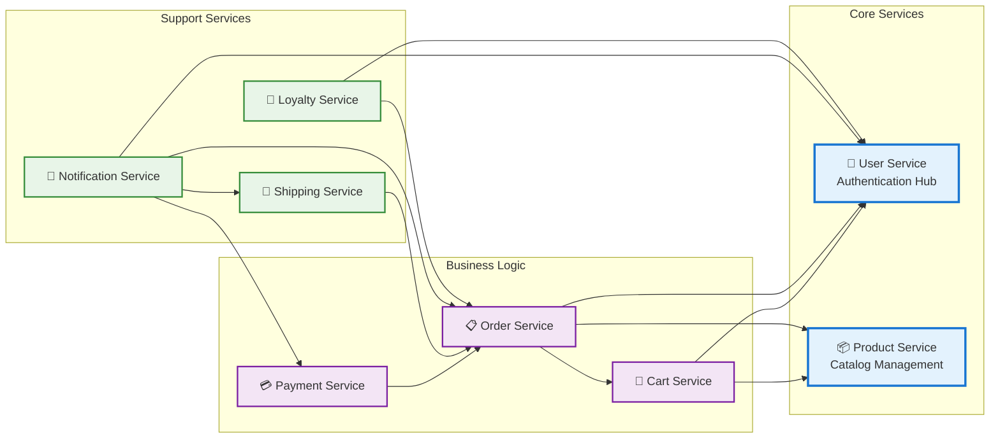

## 🚀 Deployment Flow

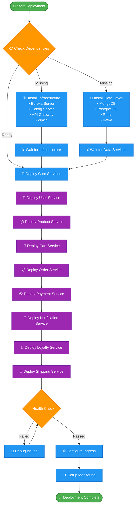

## 📊 Service Communication Patterns

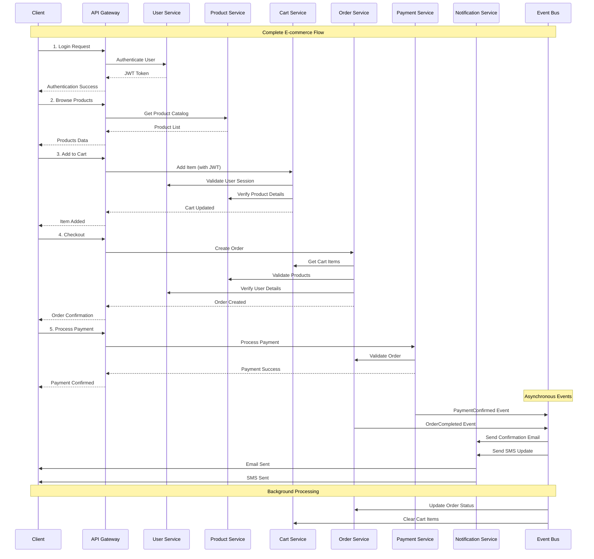

## 📋 Prerequisites

| Component | Version | Purpose |
|-----------|---------|---------|
|  | 1.20+ | Container orchestration |
|  | 3.8+ | Package management |
|  | 8GB+ | Minimum cluster memory |
|  | 4 Cores+ | Minimum cluster CPU |

### 🔗 Required Dependencies

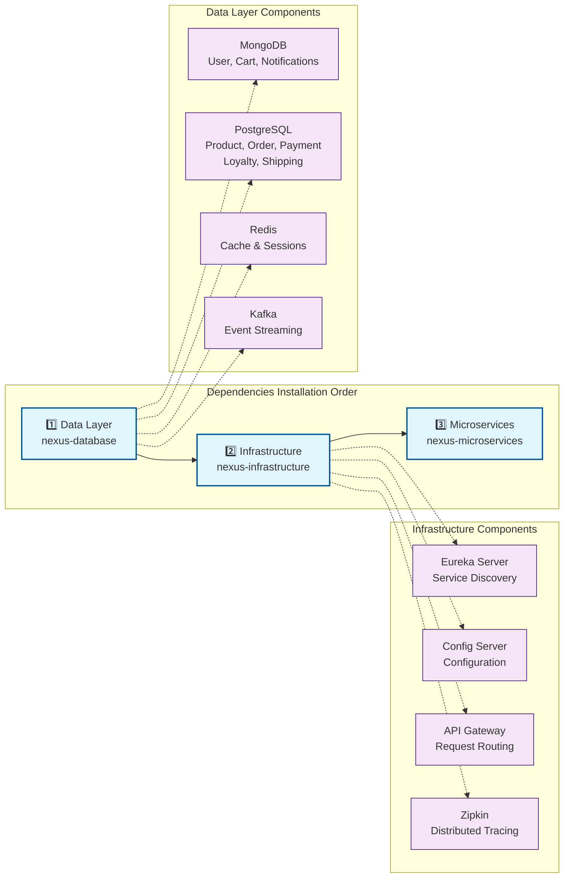

## 🚀 Quick Start

### 1️⃣ Deploy Dependencies

```bash
# Deploy the database layer
cd ../nexus-database
make dev

# Deploy the infrastructure layer
cd ../nexus-infrastructure
make dev
```

### 2️⃣ Deploy Microservices

```bash
# Development deployment
make dev

# Or using deployment script
./deploy.sh -e dev

# Or using helm directly
helm install nexus-microservices . -f values-dev.yaml \
  --namespace microservices --create-namespace
```

### 3️⃣ Production Deployment

```bash
# Production deployment
make prod

# Or with upgrade capability
./deploy.sh -e prod -u
```

## ⚙️ Environment Configurations

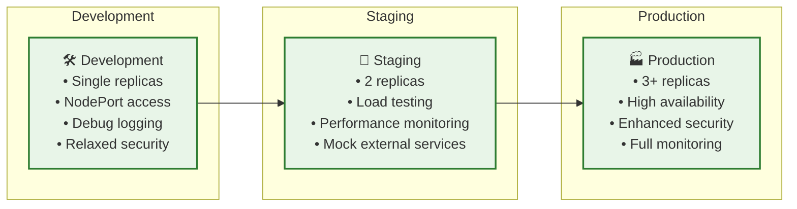

| Environment | Replicas | Resources | Purpose |
|-------------|----------|-----------|---------|
| **dev** | Minimal (1) | Low | Development & testing |
| **staging** | Medium (2) | Medium | Pre-production testing |
| **prod** | High (2-3) | High | Production workloads |

## 🛠️ Service Configuration

### Core Services

<details>
<summary><strong>👥 User Service</strong></summary>

| Parameter | Description | Default |
|-----------|-------------|---------|
| `userService.enabled` | Enable User Service | `true` |
| `userService.replicas` | Number of replicas | `2` |
| `userService.config.contextPath` | API context path | `/api/users` |
| `userService.config.database.name` | MongoDB database name | `User-service` |
| `userService.config.jwt.expirationMs` | JWT expiration time | `86400000` |

**Features:**
- 🔐 JWT Authentication
- 👤 User Profile Management
- 🔄 OAuth2 Integration
- 📊 Activity Tracking

</details>

<details>
<summary><strong>📦 Product Service</strong></summary>

| Parameter | Description | Default |
|-----------|-------------|---------|
| `productService.enabled` | Enable Product Service | `true` |
| `productService.replicas` | Number of replicas | `2` |
| `productService.config.contextPath` | API context path | `/api/products` |
| `productService.config.database.name` | PostgreSQL database name | `productdb` |

**Features:**
- 🏪 Product Catalog Management
- 🔍 Advanced Search & Filtering
- 📂 Category Management
- 🖼️ Image Upload Support

</details>

<details>
<summary><strong>🛒 Cart Service</strong></summary>

| Parameter | Description | Default |
|-----------|-------------|---------|
| `cartService.enabled` | Enable Cart Service | `true` |
| `cartService.replicas` | Number of replicas | `2` |
| `cartService.config.contextPath` | API context path | `/api/carts` |
| `cartService.config.sessionTimeout` | Cart session timeout (seconds) | `1800` |
| `cartService.config.cacheTimeout` | Cache timeout (seconds) | `600` |

**Features:**
- 🛍️ Shopping Cart Management
- ⏱️ Session Persistence
- 💾 Redis Caching
- 🔄 Auto-cleanup

</details>

<details>
<summary><strong>📋 Order Service</strong></summary>

| Parameter | Description | Default |
|-----------|-------------|---------|
| `orderService.enabled` | Enable Order Service | `true` |
| `orderService.replicas` | Number of replicas | `2` |
| `orderService.config.database.name` | PostgreSQL database name | `orderdb` |

**Features:**
- 📝 Order Processing
- 🔄 Workflow Management
- 📊 Order History
- 📈 Status Tracking

</details>

### Business Services

<details>
<summary><strong>💳 Payment Service</strong></summary>

| Parameter | Description | Default |
|-----------|-------------|---------|
| `paymentService.enabled` | Enable Payment Service | `true` |
| `paymentService.replicas` | Number of replicas | `2` |
| `paymentService.config.features.stripe` | Enable Stripe payments | `true` |
| `paymentService.config.features.paypal` | Enable PayPal payments | `false` |
| `paymentService.config.security.maxPaymentAmount` | Maximum payment amount | `10000.00` |

**Features:**
- 💎 Stripe Integration
- 🌐 PayPal Support
- 🔒 PCI Compliance Ready
- 🛡️ Fraud Detection
- 💰 Refund Processing

</details>

<details>
<summary><strong>📢 Notification Service</strong></summary>

| Parameter | Description | Default |
|-----------|-------------|---------|
| `notificationService.enabled` | Enable Notification Service | `true` |
| `notificationService.replicas` | Number of replicas | `2` |
| `notificationService.config.features.email` | Enable email notifications | `true` |
| `notificationService.config.features.sms` | Enable SMS notifications | `false` |
| `notificationService.config.features.websocket` | Enable WebSocket notifications | `false` |

**Features:**
- 📧 Email Notifications
- 📱 SMS Support
- 🔄 Real-time WebSockets
- 📋 Template Management

</details>

### Support Services

<details>
<summary><strong>🎁 Loyalty Service</strong></summary>

| Parameter | Description | Default |
|-----------|-------------|---------|
| `loyaltyService.enabled` | Enable Loyalty Service | `true` |
| `loyaltyService.replicas` | Number of replicas | `2` |
| `loyaltyService.config.contextPath` | API context path | `/api/loyalty` |
| `loyaltyService.config.tiers.goldThreshold` | Points for Gold tier | `2000` |
| `loyaltyService.config.points.orderRate` | Points per dollar spent | `1.0` |

**Features:**
- 🏆 Tier Management (Bronze → Diamond)
- 💎 Points System
- 🎊 Rewards Program
- 🎟️ Coupon Management

</details>

<details>
<summary><strong>🚚 Shipping Service</strong></summary>

| Parameter | Description | Default |
|-----------|-------------|---------|
| `shippingService.enabled` | Enable Shipping Service | `true` |
| `shippingService.replicas` | Number of replicas | `1` |
| `shippingService.config.features.gpsTracking` | Enable GPS tracking | `true` |
| `shippingService.config.features.realTimeLocation` | Enable real-time location | `true` |

**Features:**
- 📍 GPS Tracking
- 🗺️ Real-time Location Updates
- 📦 Delivery Management
- 📊 Logistics Analytics

</details>

## 🌐 Service Endpoints

### Internal Service URLs

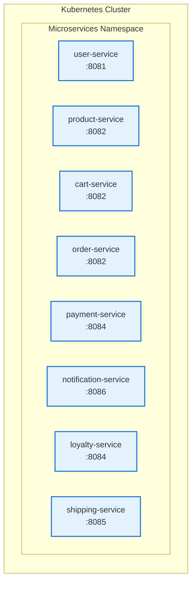

| Service | Internal URL | API Context |
|---------|-------------|------------|
| 👥 **User** | `http://user-service.microservices.svc.cluster.local:8081` | `/api/users` |
| 📦 **Product** | `http://product-service.microservices.svc.cluster.local:8082` | `/api/products` |
| 🛒 **Cart** | `http://cart-service.microservices.svc.cluster.local:8082` | `/api/carts` |
| 📋 **Order** | `http://order-service.microservices.svc.cluster.local:8082` | `/api/orders` |
| 💳 **Payment** | `http://payment-service.microservices.svc.cluster.local:8084` | `/api/payments` |
| 📢 **Notification** | `http://notification-service.microservices.svc.cluster.local:8086` | `/api/notifications` |
| 🎁 **Loyalty** | `http://loyalty-service.microservices.svc.cluster.local:8084` | `/api/loyalty` |
| 🚚 **Shipping** | `http://shipping-service.microservices.svc.cluster.local:8085` | `/api/shipping` |

### 🏥 Health Check URLs

```bash
# Check individual service health
curl http://user-service.microservices.svc.cluster.local:8081/api/users/actuator/health
curl http://product-service.microservices.svc.cluster.local:8082/api/products/actuator/health
curl http://cart-service.microservices.svc.cluster.local:8082/api/carts/actuator/health
curl http://order-service.microservices.svc.cluster.local:8082/actuator/health
curl http://payment-service.microservices.svc.cluster.local:8084/health
curl http://notification-service.microservices.svc.cluster.local:8086/actuator/health
curl http://loyalty-service.microservices.svc.cluster.local:8084/api/loyalty/actuator/health
curl http://shipping-service.microservices.svc.cluster.local:8085/health
```

## 🌐 Development Access

### NodePort Access (Development)

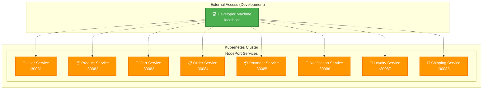

| Service | Development URL | Production URL |
|---------|-----------------|----------------|
| 👥 User | `http://localhost:30081` | `https://api.nexuscommerce.com/api/users` |
| 📦 Product | `http://localhost:30082` | `https://api.nexuscommerce.com/api/products` |
| 🛒 Cart | `http://localhost:30083` | `https://api.nexuscommerce.com/api/carts` |
| 📋 Order | `http://localhost:30084` | `https://api.nexuscommerce.com/api/orders` |
| 💳 Payment | `http://localhost:30085` | `https://api.nexuscommerce.com/api/payments` |
| 📢 Notification | `http://localhost:30086` | `https://api.nexuscommerce.com/api/notifications` |
| 🎁 Loyalty | `http://localhost:30087` | `https://api.nexuscommerce.com/api/loyalty` |
| 🚚 Shipping | `http://localhost:30088` | `https://api.nexuscommerce.com/api/shipping` |

### Port Forwarding Setup

```bash
# Set up port forwarding for all services
make port-forward

# Individual port forwarding
kubectl port-forward -n microservices svc/user-service 8081:8081
kubectl port-forward -n microservices svc/product-service 8082:8082
kubectl port-forward -n microservices svc/payment-service 8085:8084
```

## 📊 Monitoring & Observability

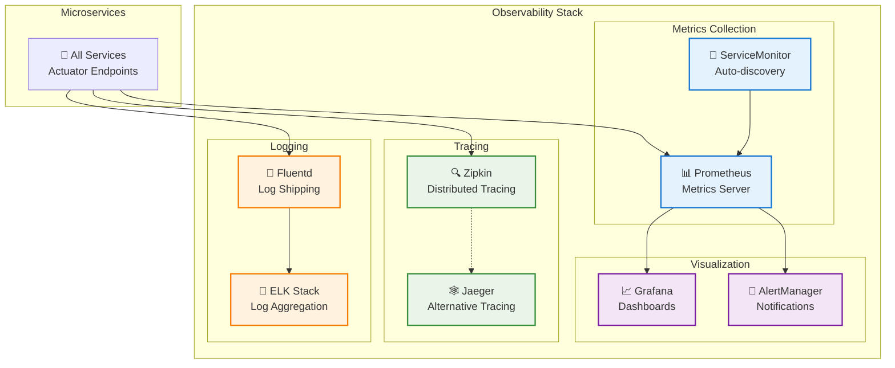

### Monitoring Features

- **📊 Prometheus Metrics**: Automatic collection from all services
- **📈 Grafana Dashboards**: Pre-configured business and technical dashboards
- **🚨 Alert Rules**: Production-ready alerting for critical issues
- **🔍 Distributed Tracing**: Request tracking across services
- **🏥 Health Checks**: Comprehensive health monitoring

## 🔐 Security Configuration

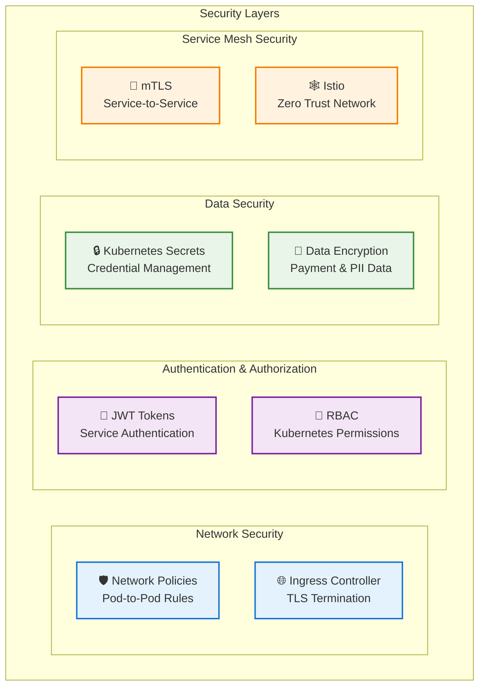

### Security Features by Environment

| Feature | Development | Staging | Production |
|---------|-------------|---------|------------|
| **Network Policies** | ❌ Disabled | ❌ Disabled | ✅ Enabled |
| **TLS/SSL** | ❌ HTTP Only | ✅ Let's Encrypt | ✅ Valid Certificates |
| **RBAC** | ✅ Basic | ✅ Enhanced | ✅ Strict |
| **Pod Security** | ❌ Relaxed | ✅ Standard | ✅ Restricted |
| **Secret Management** | ✅ Basic | ✅ Encrypted | ✅ Vault Integration |
| **Service Mesh** | ❌ Disabled | ✅ Optional | ✅ mTLS Enabled |

## 📈 Scaling & Performance

### Horizontal Pod Autoscaling

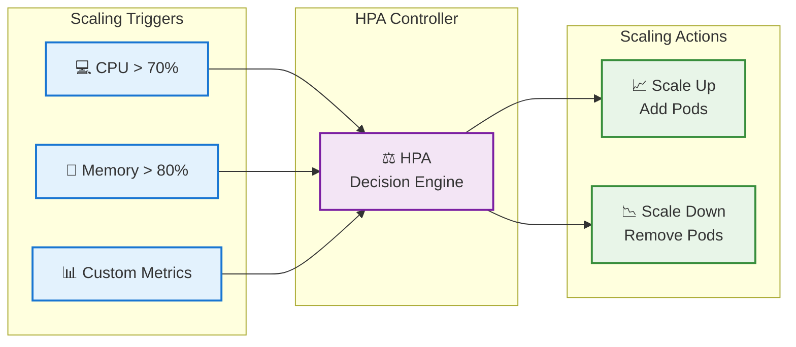

### Scaling Configuration

```bash
# Enable autoscaling
helm upgrade nexus-microservices . \
  --set autoscaling.enabled=true \
  --set autoscaling.minReplicas=2 \
  --set autoscaling.maxReplicas=10 \
  --namespace microservices

# Manual scaling
make scale SERVICE=user-service REPLICAS=5

# Check scaling status
kubectl get hpa -n microservices
```

## 🚨 Troubleshooting

### Common Issues & Solutions

<details>
<summary><strong>🔴 Services not registering with Eureka</strong></summary>

```bash
# Check Eureka connectivity
kubectl logs -n microservices user-service-0

# Verify Eureka server status
kubectl get svc -n infrastructure eureka-server

# Test connectivity from pod
kubectl exec -n microservices user-service-0 -- nc -zv eureka-server.infrastructure.svc.cluster.local 8761
```

</details>

<details>
<summary><strong>🔴 Database connection failures</strong></summary>

```bash
# Check database service status
kubectl get svc -n data

# Verify PostgreSQL/MongoDB pods
kubectl get pods -n data -l app=postgres
kubectl get pods -n data -l app=mongodb

# Test database connectivity
kubectl exec -n microservices product-service-0 -- nc -zv postgres-service.data.svc.cluster.local 5432
```

</details>

<details>
<summary><strong>🔴 Payment service startup failures</strong></summary>

```bash
# Check payment service logs
kubectl logs -n microservices payment-service-0

# Verify secrets
kubectl get secrets -n microservices payment-service-secrets -o yaml

# Check Stripe API connectivity (if enabled)
kubectl exec -n microservices payment-service-0 -- curl -s https://api.stripe.com/v1
```

</details>

### Useful Commands

```bash
# Check all microservices status
make status

# View logs for all microservices
make logs

# View logs for specific service
make logs-user
make logs-payment

# Check service health
make health

# Restart all services
make restart

# Debug specific service
make debug SERVICE=payment-service

# Test connectivity from within cluster
kubectl run -n microservices debug --image=busybox -it --rm -- sh
```

## 🔄 Deployment Order

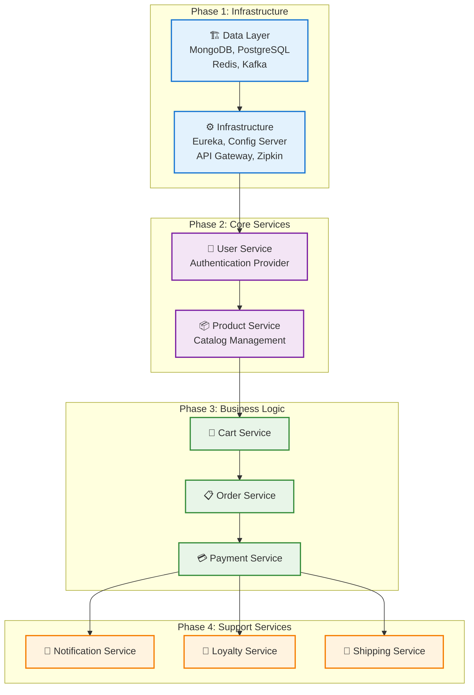

## 📝 API Documentation

Each service exposes comprehensive API documentation:

| Service | Swagger UI | OpenAPI Spec |
|---------|------------|-------------|
| 👥 **User** | `/api/users/swagger-ui.html` | `/api/users/v3/api-docs` |
| 📦 **Product** | `/api/products/swagger-ui.html` | `/api/products/v3/api-docs` |
| 🛒 **Cart** | `/api/carts/swagger-ui.html` | `/api/carts/v3/api-docs` |
| 📋 **Order** | `/actuator/swagger-ui.html` | `/v3/api-docs` |
| 💳 **Payment** | `/docs` | `/docs/json` |
| 📢 **Notification** | `/actuator/swagger-ui.html` | `/v3/api-docs` |
| 🎁 **Loyalty** | `/api/loyalty/swagger-ui.html` | `/api/loyalty/v3/api-docs` |
| 🚚 **Shipping** | `/docs` | `/docs/json` |

## 🧪 Testing

### Load Testing

```bash
# Install dependencies for testing
helm install nexus-microservices . -f values-dev.yaml

# Run load tests with k6
kubectl apply -f tests/load-tests.yaml

# Check test results
kubectl logs -l app=load-tests
```

### Integration Testing

```bash
# Run integration tests
kubectl apply -f tests/integration-tests.yaml

# Monitor test progress
kubectl logs -f -l app=integration-tests
```

## 🗑️ Uninstallation

### Complete Removal ⚠️ (Data Loss)

```bash
# Using make
make clean

# Using script with force deletion
./undeploy.sh -f

# Using helm directly
helm uninstall nexus-microservices -n microservices
kubectl delete namespace microservices
```

### Keep Data (Preserve PVCs)

```bash
# Preserve persistent volumes
./undeploy.sh -k
```

## 🤝 Contributing

We welcome contributions! Please see our [Contributing Guide](CONTRIBUTING.md) for details.

1. 🍴 Fork the repository
2. 🌿 Create a feature branch (`git checkout -b feature/amazing-feature`)
3. 💻 Make your changes and test thoroughly
4. 📝 Update documentation
5. 🚀 Submit a pull request

### Adding New Microservices

1. Add configuration to `values.yaml`
2. Create templates in `templates/service-name/` directory
3. Update `_helpers.tpl` with new labels
4. Add health checks and init containers
5. Test with `helm template`
6. Update documentation

## 📄 License

This project is licensed under the MIT License - see the [LICENSE](LICENSE) file for details.

## 🆘 Support

- **📚 Documentation**: [docs.nexuscommerce.com](https://docs.nexuscommerce.com)
- **🐛 Issues**: [GitHub Issues](https://github.com/nexuscommerce/helm-charts/issues)
- **💬 Discord**: [NexusCommerce Community](https://discord.gg/nexuscommerce)
- **📧 Email**: support@nexuscommerce.com

## 🗺️ Roadmap

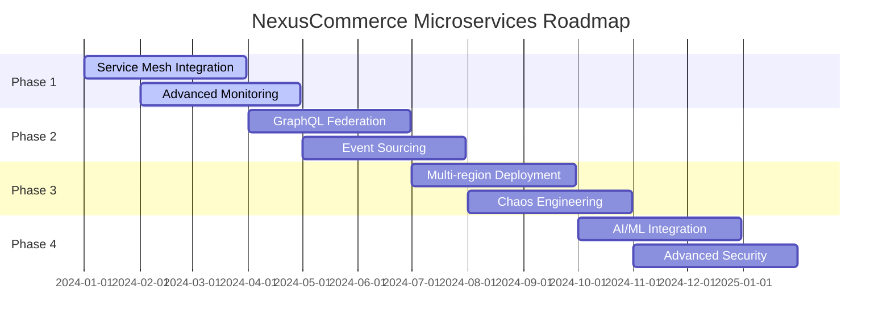

- ✅ **Q1 2024**: Service mesh complete integration
- 🔄 **Q2 2024**: Advanced monitoring and alerting
- 📋 **Q3 2024**: GraphQL federation gateway
- 🎯 **Q4 2024**: Event sourcing implementation
- 🚀 **2025**: Multi-region deployment support

---

<div align="center">

**⭐ Star this repository if it helped you!**

[](https://github.com/nexuscommerce/helm-charts)
[](https://github.com/nexuscommerce/helm-charts/fork)
[](https://github.com/nexuscommerce/helm-charts)

Made with ❤️ by the [NexusCommerce Team](https://github.com/nexuscommerce)

</div>